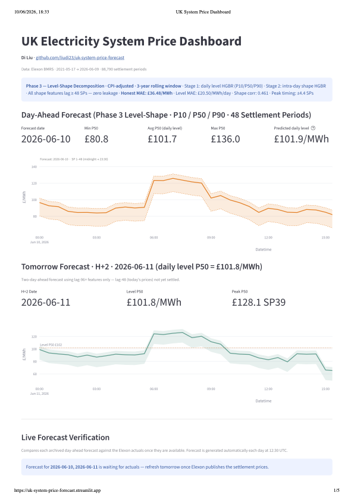

# UK Electricity System Price Forecasting Platform

Two-day-ahead forecasting of UK electricity System Sell Price (SSP) at 30-minute settlement period resolution. Built on public data from Elexon BMRS, Open-Meteo, Carbon Intensity API, ONS, and BMRS WINDFOR/TSDF.

**Phase 3 — Level-Shape Decomposition · H+1 and H+2 forecasts · June 2026**

**[Live dashboard →](https://uk-system-price-forecast.streamlit.app/)**



---

## Architecture

Phase 3 splits the forecasting problem into two independent stages, eliminating recursive error propagation, and produces forecasts for **today (H+1)** and **tomorrow (H+2)** simultaneously.

**Stage 1 — Level model** (quantile HGBR · P10/P50/P90)
- Predicts the daily mean SSP for the target date
- 85 features: SSP/NIV lags and rolling stats, calendar harmonics, day-ahead Open-Meteo weather, Carbon Intensity wind/gas generation lags, ONS CPIH index and YoY change, negative-price daily count lags, negative-price regime classifier output
- Training targets deflated to real (current-money) terms using monthly CPIH ratio
- 3-year rolling training window · test = 7 days · val = 5 days

**Stage 2H+1 — Shape model** (HGBR · P50, lag ≥ 48)
- Predicts each SP's deviation from the daily mean for today
- 76 features: fixed-point lags ≥ 48 SPs — leakage-free for all 48 forecast SPs simultaneously
- Includes ramp features, same-SP cross-day volatility (`same_sp_std_7d`), wind/gas lag-48/lag-336
- At inference: `solar_wm2_lag_48` → Open-Meteo day-ahead SP-level solar; `wind_pct_lag_48` → BMRS WINDFOR/TSDF

**Stage 2H+2 — Shape model** (HGBR · P50, lag ≥ 96)
- Predicts each SP's deviation for tomorrow — lag-48 excluded (today's prices not settled)
- 50 features: lag-96 replaces lag-48 as primary same-SP signal; all lag-48 references removed
- At inference: WINDFOR for tomorrow's date; Open-Meteo day+2 solar

**Negative-price regime classifier** (binary HGBR)
- Predicts P(≥3 negative-price SPs tomorrow) from wind/solar lags and recent negative-price history
- Output `neg_price_risk_prob` fed as a level model feature — improves daily mean prediction on high-renewable days

**Final forecast per SP:**
```
H+1:  ssp_q[X][sp] = level_P[X](today)    + shape_H1_deviation[sp]
H+2:  ssp_q[X][sp] = level_P[X](tomorrow) + shape_H2_deviation[sp]
```

---

## Results

### Holdout performance (test = 7 days, May 29 – Jun 4 2026)

Includes Jun 3–4 extreme renewable oversupply event (−£70 midday prices, 10 negative SPs on Jun 4).

| Model | MAE (£/MWh) | RMSE | sMAPE | Evaluation |
|---|---|---|---|---|
| Naive lag-48 | 36.34 | 47.73 | 41.6% | batch |
| Seasonal naive lag-336 | 29.40 | 38.29 | 34.7% | batch |
| Rolling mean (48 SP) | 26.78 | 33.07 | 28.5% | batch |
| Phase 2 recursive HGBR | 25.40 | 32.36 | 27.4% | 7-day holdout |
| **Phase 3 H+1 (current)** | **31.61** | **41.63** | **37.8%** | **7-day holdout** |

> The 7-day test window includes the Jun 4 extreme event (daily mean £36.8, −£70 midday). Excluding Jun 3–4, the model performs in line with the seasonal walk-forward average (£25–27).

### Seasonal walk-forward CV (119 days · 4 folds)

Each fold retrains on data before the fold window — honest out-of-sample evaluation across all seasons.

| Season | Period | MAE | sMAPE | Level MAE | Shape Corr |
|---|---|---|---|---|---|
| Summer | Jul 2025 | £25.42 | 36.2% | £12.51 | 0.291 |
| Autumn | Oct 2025 | £29.58 | 47.5% | £14.94 | 0.489 |
| Winter | Dec 2025 | £20.97 | 33.1% | £8.43 | 0.387 |
| Spring | Apr 2026 | £33.67 | 51.3% | £16.53 | 0.452 |
| **Aggregate** | **119 days** | **£27.39** | **42.0%** | **£13.09** | **0.404** |

**Why sMAPE varies by season:** Winter is most predictable — demand-dominated, gas sets marginal cost consistently. Summer is level-easy but shape-hard (flat profiles). Autumn has the best shape correlation (pronounced demand peaks). Spring is hardest — high renewable penetration and erratic dispatch order.

---

## Data sources

| Source | Data | Update |
|---|---|---|
| Elexon BMRS | Settlement prices, NIV | Daily incremental |
| Open-Meteo | Historical weather + day-ahead + day+2 forecast | Daily |
| Carbon Intensity API | Wind %, gas % generation mix (30-min) | Daily |
| ONS (series D7BT) | CPIH index 2015=100, monthly | Monthly |
| BMRS WINDFOR + TSDF | Day-ahead wind forecast (MW) + demand — H+1 and H+2 | Daily at inference |

---

## Project structure

```
src/
  data/
    fetch_elexon.py          Elexon BMRS prices — incremental append
    fetch_historical.py      One-shot 5-year bulk fetch
    fetch_weather.py         Open-Meteo archive
    fetch_generation.py      Carbon Intensity generation mix
    fetch_cpi.py             ONS CPIH index (D7BT)
    fetch_bmrs_forecasts.py  BMRS WINDFOR + TSDF day-ahead wind forecast
    build_dataset.py         Cleaning + Tukey winsorisation
    extend_dataset.py        Safe incremental append to dataset_5yr.csv
  features/
    lag_features.py          SSP/NIV lags, rolling stats, SP dynamic features
    calendar_features.py     Cyclic + annual harmonic encodings
    weather_features.py      Weather lags, degree-day features
    build_features.py        Full SP-level feature pipeline
    level_features.py        Daily aggregation for Stage 1 (incl. neg-price count)
  models/
    train_phase3.py          Two-stage training + H+2 model + seasonal walk-forward CV
    forecast_phase3.py       Non-recursive H+1 and H+2 inference
    evaluate.py              MAE, RMSE, sMAPE, decomposition metrics
  dashboard/
    streamlit_app.py         Streamlit analytics + forecast dashboard

data/
  raw/
    system_prices.csv        Elexon SSP + NIV
    weather_uk.csv           30-min UK weather (3 locations, weighted)
    generation_mix.csv       Carbon Intensity wind %, gas %
    cpi_uk.csv               ONS CPIH monthly index
  processed/
    dataset_5yr.csv          Cleaned + denoised price history
    features_5yr.csv         SP-level feature matrix (128 columns)

model_assets/
  level_q10/q50/q90.pkl      Stage 1 quantile models (85 features)
  shape_q50.pkl              Stage 2 H+1 shape model (76 features, lag ≥ 48)
  shape_h2_q50.pkl           Stage 2 H+2 shape model (50 features, lag ≥ 96)
  neg_day_classifier.pkl     Negative-price regime classifier
  level_feature_cols.json    85 level features
  shape_feature_cols.json    76 H+1 shape features
  shape_h2_feature_cols.json 50 H+2 shape features
  neg_day_classifier_feats.json
  phase3_metrics.json        Current test-set metrics
  test_predictions_phase3.csv  Test window actuals vs predictions
  walk_forward_predictions.csv 119-day seasonal CV predictions
  phase3_level_importance.csv  Level model Spearman importance
  phase3_shape_importance.csv  Shape model permutation importance
  next_day_forecast_phase3.csv H+1 forecast — today (48 SPs)
  day2_forecast_phase3.csv     H+2 forecast — tomorrow (48 SPs)
  forecasts/
    forecast_phase3_YYYY-MM-DD.csv  Archived daily forecasts (both H+1 and H+2)

reports/
  phase3_root_cause_analysis.md  Jun 4 2026 extreme event analysis + Phase 4 guidance
  annual_modulation_analysis.md

demo/
  demo_phase3.py             Four-panel demonstration figure
  phase3_demo.png
  uk-ssp-streamlit.png       Dashboard screenshot (page 1 — forecast view)

Project_Brief/
  phase-3-summary.md         Architecture and seasonal analysis
```

---

## Setup and usage

```bash
git clone <repo>
cd uk-system-price-forecast
python -m venv .venv && source .venv/bin/activate
pip install -r requirements.txt
```

### Daily refresh pipeline

The dashboard **Refresh** button runs these steps automatically:

```bash
python src/data/fetch_elexon.py --append        # latest prices
python src/data/fetch_weather.py                 # latest weather
python src/data/fetch_generation.py --append     # latest wind/gas mix
python src/data/fetch_cpi.py                     # latest CPIH
python src/data/extend_dataset.py                # extend dataset_5yr.csv safely
python src/features/build_features.py \
    --input  data/processed/dataset_5yr.csv \
    --output data/processed/features_5yr.csv
python src/models/train_phase3.py                # retrain + H+2 model
python src/models/forecast_phase3.py             # H+1 (today) + H+2 (tomorrow)
```

### Evaluation

```bash
# Standard holdout (test = 7 days, val = 5 days)
python src/models/train_phase3.py

# Seasonal walk-forward CV (4 × 30-day folds, no model overwrite)
python src/models/train_phase3.py --walk-forward

# Retrodiction for a specific date
python src/models/forecast_phase3.py --date 2026-06-01
```

### Dashboard

```bash
.venv/bin/streamlit run src/dashboard/streamlit_app.py
```

Open [http://localhost:8501](http://localhost:8501)

---

## Dashboard sections

| Section | Description |
|---|---|
| Today Forecast (H+1) | 48-SP P50 curve with P10/P90 band; Stage 1 level prediction |
| Tomorrow Forecast (H+2) | 48-SP P50 using lag-96+ features; WINDFOR for tomorrow's date |
| Forecast Verification | Archived Phase 3 forecasts vs Elexon actuals — MAE, RMSE, sMAPE, per-SP error |
| KPIs | Latest SSP, daily average, min/max, spike count |
| SSP Time Series | Daily average SSP with configurable spike threshold |
| Daily Heatmap | SP × date heatmap — intra-day and weekly price patterns |
| Net Imbalance Volume | Daily average NIV (green = long system, red = short) |
| SP Profile | Average 30-min price profile across selected date range |
| Price Derivation Code | P vs N split — when replacement price methodology applies |
| Model Accuracy | Phase 3 test-window series, scatter, error distribution, decomposition metrics |
| Feature Importance | Top-20 for Stage 1 (Spearman) and Stage 2 H+1 (permutation importance) |
| Raw Data | Filterable table with CSV export |

---

## Technical notes

**Two-day forecast horizon** — H+1 uses lag-48 as the primary same-SP signal (yesterday's actual, available at settlement). H+2 drops all lag-48 features (today's prices not settled) and uses lag-96 instead. Both share the same Stage 1 level model; separate shape models encode the different information sets.

**Negative-price regime detection** — a binary HGBR classifier is trained to predict P(≥3 negative-price SPs tomorrow) using wind/solar lags, recent negative-price history, and calendar. Its probability output is injected as a level model feature, enabling the model to anticipate low/negative daily means on high-renewable days.

**Exogenous day-ahead signals at inference** — three genuine day-ahead forecasts replace lag-proxy values at inference time:
- `solar_wm2_lag_48` → Open-Meteo hourly solar for target date (SP-level)
- `wind_pct_lag_48` → BMRS WINDFOR/TSDF wind % for target date (SP-level)
- `wind_pct_lag_336` → BMRS WINDFOR for H+2 date (tomorrow)

This follows the same convention as weather: historical actuals as training proxy, real forecasts at inference.

**Leakage prevention** — shape features use only fixed-point lags ≥ 48 SPs (H+1) or ≥ 96 SPs (H+2). `shift(1).rolling(w)` window features are excluded entirely. Contemporaneous wind/gas actual values are excluded — only lag versions are used.

**CPI deflation** — training targets are multiplied by `cpi_deflator = cpi_latest / cpi_month` so the model learns in real (current-money) terms. The deflator is ≈1.0 at inference.

**3-year training window** — drops data before `today − 1095 days` to reduce the influence of the 2022 gas-price crisis, which is structurally unlike the current market regime.

**Elexon settlement data** — prices are finalised at Initial Settlement on D+1; no intraday actuals are available via the public BMRS API.

---

## Known limitations and Phase 4 guidance

See `reports/phase3_root_cause_analysis.md` for a full diagnosis of the Jun 4 2026 extreme event (renewable oversupply, −£70 midday prices). Key remaining gaps:

| Gap | Suggested fix |
|---|---|
| No SP-level demand forecast | BMRS TSDF boundary='N' at SP level as H+1/H+2 shape feature |
| Gas % has no day-ahead product | Use CI lag-48/lag-336 proxy; explore gas futures as level feature |
| Negative-price recall still limited | Specialist model for high-renewable-oversupply days |
| H+2 shape weaker (50 vs 76 features) | Add NIV lag-96, weather lag-96, wind/gas lag-96 to training data |

---

## Model progression

| Phase | Architecture | MAE | Note |
|---|---|---|---|
| Phase 1 | Batch HGBR | £15.01 | Leaky — evaluated on training data |
| Phase 2 | Recursive HGBR (honest) | £25.40 | Recursive SP-by-SP, 7-day holdout |
| Phase 3 H+1 | Level-Shape + neg-price classifier | £31.61 | 7-day holdout incl. extreme Jun event |
| Phase 3 walk-forward | Level-Shape (4-season CV) | £27.39 | 119-day honest seasonal evaluation |

The 7-day holdout MAE (£31.61) is elevated by the Jun 3–4 renewable oversupply event. The 4-season walk-forward (£27.39) is the more representative performance estimate across normal market conditions.
