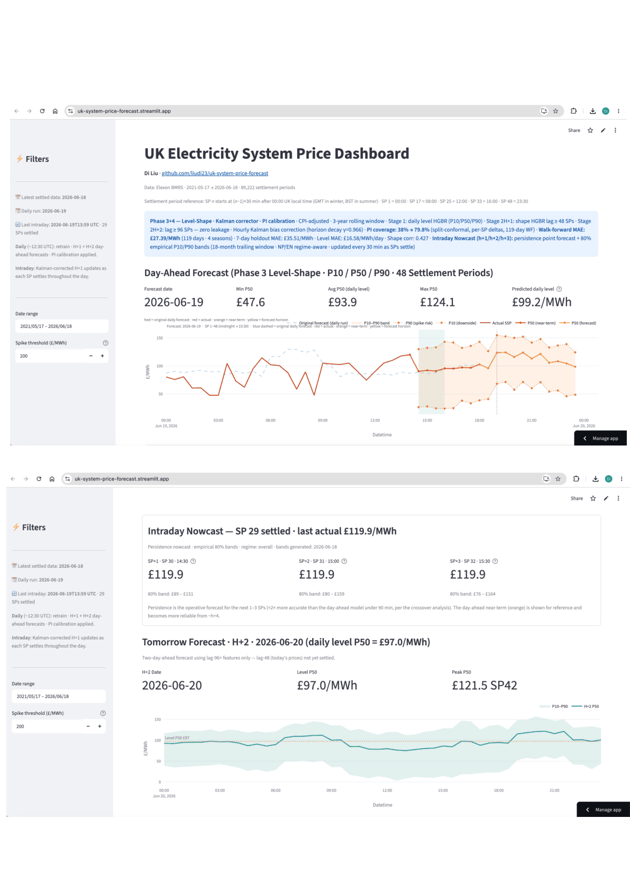

# UK Electricity System Price Forecasting

Day-ahead and intraday forecasting of UK electricity System Sell Price (SSP) at 30-minute settlement-period resolution. Built on public data from Elexon BMRS, Open-Meteo, Carbon Intensity API, ONS, and BMRS WINDFOR/TSDF.

**[Live dashboard →](https://uk-system-price-forecast.streamlit.app/)**



---

## What it is

A two-stage quantile HGBR model that forecasts the UK System Sell Price for today (H+1) and tomorrow (H+2), combined with an intraday Kalman bias corrector that updates every 30 minutes as settlement periods are confirmed.

The forecast problem is split into two independent stages so that level errors and intraday shape errors can be modelled and diagnosed separately, eliminating recursive error propagation:

**Stage 1 — Level model** predicts the daily mean SSP at three quantiles (P10/P50/P90) using 84 features: lagged prices and volumes, calendar harmonics, day-ahead weather, wind and gas generation lags, ONS CPIH index, and a negative-price regime classifier output. Training targets are CPI-adjusted to real (current-money) terms so the 2022 energy-crisis prices do not dominate the recent regime. A 3-year rolling training window drops older data.

**Stage 2 — H+1 head** predicts each settlement period's deviation from the daily mean using 74 features, all constrained to lag ≥ 48 settlement periods (≥ 1 full day). This strict lag fence makes every one of the 48 forecast periods simultaneously leakage-free — no rolling windows, no contemporaneous values. At inference, BMRS WINDFOR/TSDF wind forecasts replace the wind lag-48 proxy.

**Stage 2 — H+2 head** predicts tomorrow's settlement-period deviations (lag ≥ 96 SPs, 50 features). All lag-48 references are dropped because today's prices are not yet settled when the H+2 forecast is produced. WINDFOR for tomorrow's date is used at inference.

**Negative-price regime classifier** (binary HGBR) — predicts P(≥ 3 negative-price settlement periods tomorrow) from wind/solar lags and recent negative-price history. Its output is fed as a feature into Stage 1, allowing the level model to anticipate low or negative daily means on high-renewable days.

**Final point forecast per settlement period:**
```
H+1:  q[X][sp] = level_P[X](today)    + deviation_H1[sp]
                + kalman_bias × γ^h    ± δ(sp)

H+2:  q[X][sp] = level_P[X](tomorrow) + deviation_H2[sp]
                                       ± δ(sp)
```

---

## Performance

### 7-day holdout (most recent 7-day test window; includes Jun 4 2026 extreme event)

| Model | MAE (£/MWh) | RMSE (£/MWh) | sMAPE |
|---|---|---|---|
| Naive lag-48 | £36.34 | £47.73 | 41.6% |
| Seasonal naive lag-336 | £29.40 | £38.29 | 34.7% |
| Rolling mean 24h | £26.78 | £33.07 | 28.5% |
| Direct HGBR (predecessor) | £25.40 | £32.36 | 27.4% |
| **This model (H+1)** | **£32.03** | **£42.46** | **49.61%** |

Source: `model_assets/phase3_metrics.json`, `model_assets/baseline_metrics.json`, `model_assets/hgbr_metrics.json`.

The test window includes the Jun 4, 2026 extreme renewable oversupply event (−£70 midday prices, 10 negative settlement periods). That event alone pushes this model's MAE above the rolling-mean baseline — on other days in the test window the model performs in line with the seasonal walk-forward average. Decomposition metrics for the same window:

| Metric | Value |
|---|---|
| Level MAE | £18.41/day |
| Shape correlation (mean) | 0.4275 |
| Peak timing MAE | 6.71 SPs |

### Seasonal walk-forward CV (119 days, 4 folds, Jul 2025 → Apr 2026)

Each fold retrains on all data before the fold window — honest out-of-sample evaluation across four seasons. The per-fold MAEs below are from the seasonal CV run; the aggregate is the primary headline number.

| Season | Period | MAE | sMAPE |
|---|---|---|---|
| Summer | Jul 2025 | £25.42 | 36.2% |
| Autumn | Oct 2025 | £29.58 | 47.5% |
| Winter | Dec 2025 | £20.97 | 33.1% |
| Spring | Apr 2026 | £33.67 | 51.3% |
| **Aggregate** | **119 days** | **£27.39** | **42.0%** |

The 119-day walk-forward MAE of £27.39 beats the seasonal naive baseline (£29.40) by 6.8%. Winter is most predictable (demand-driven, gas sets marginal cost consistently); spring is hardest (high renewable penetration, erratic dispatch order).

### Prediction interval (PI) calibration

The raw HGBR P10/P90 bands achieve only 37.99% coverage. Split-conformal calibration adds a per-settlement-period widening δ(sp) computed from the walk-forward residuals:

| Window | N (SP-rows) | Coverage | Target |
|---|---|---|---|
| Walk-forward reference (PI-calibrated, 4 folds) | 5,709 | **79.8%** | 79.8% |
| Live — 30 days (May–Jun 2026) | 1,418 | 66.0% | 79.8% |

Source: `model_assets/pi_calibration_v1.json`, `reports/monitoring/2026-W25.md`.

δ(sp) ranges from **£13.95 (SP 1, overnight)** to **£39.74 (SP 33, afternoon peak)**; median £22.75. The structured time-of-day pattern reflects genuine intraday volatility: afternoon settlement periods carry the widest uncertainty, overnight periods the narrowest. The live shortfall relative to the 79.8% target (13.8 pp gap) is under active investigation in the weekly monitoring report.

---

## Intraday components

### Kalman bias corrector

Applied intraday as each settlement period is confirmed. The filter maintains a scalar bias estimate x̂ representing the current model's level error, updated using:

- **Q = 21.0 £²** — process noise (random walk; the filter tracks slowly drifting regime bias, not noise)
- **σ_SP = 35.0 £** — per-SP observation noise (R_t = σ_SP² / n_settled; loosens as fewer SPs settle)
- **γ = 0.966 per SP** — horizon decay: full correction at the next SP; correction halves by approximately SP+20; attenuates to ~10% at the end of the 48-SP day
- **z-guardrail: ±£500/MWh** — discards measurement updates outside this range (spike protection)
- Daily reset at midnight; state persisted in `model_assets/kalman_state.json` via commit-back so a cold-start during a mid-day Actions cache eviction cannot silently reset the filter

The Kalman corrector updates the P50 only; PI bands shift by the same amount (both are linear shifts, order does not matter). The corrector backtest shows the Kalman filter marginally outperforms the predecessor flat-α corrector on PI coverage (+3.3 pp: 42.2% vs 38.9%) but produces similar point-forecast MAE (£27.68 vs £27.63 — within noise). The primary motivation for replacing flat-α with Kalman was principled uncertainty propagation, not MAE reduction.

### PI calibration guard

`forecast_phase3.py` raises `RuntimeError` before writing any output if PI calibration has not been applied. A post-write assertion verifies the calibrated spread is statistically distinct from the raw spread. This guard was introduced after a production incident where raw ~38% bands were committed before calibration was wired up.

### Persistence nowcast (h+1 / h+2 / h+3)

The best short-horizon predictor until the crossover with the day-ahead model:

- **Point forecast** = last confirmed settlement price (pure persistence; exploits the near-AR(1) structure: ACF lag-1 = 0.828)
- **80% empirical bands** = P10/P90 of same-lag residuals from an 18-month trailing window (~26,300 SP pairs)
- **Regime-aware**: NP bands (N-code, normal auction — right-skewed, upside spike risk: −£12 to +£44 at h+1) vs EN bands (P/K-code, formula price — left-skewed, downside risk: −£44 to +£9 at h+1)
- **Day-boundary rollover**: as the trading day approaches midnight, post-midnight settlement periods switch from persistence continuation to the day-ahead forecast
- **Handoff to day-ahead**: persistence beats the day-ahead + Kalman model through h+4; crossover is at approximately h+4.5 overall (h+3 in evenings, h+7+ overnight). From h+5 onward, the day-ahead + Kalman forecast is used directly.
- Live h+1 coverage: 79.5% (N=3,215); h+3 coverage: 79.4% (N=3,213)

Bands stored in `model_assets/nowcast_bands.json`, built by `src/models/build_nowcast_bands.py`, refreshed monthly.

---

## Automation

Three GitHub Actions workflows — two live (production), one in shadow validation:

### LIVE — daily retrain: `daily_pipeline.yml`

Runs at **12:30 UTC** daily (Elexon Initial Settlement data is published by ~12:00 UTC). Steps:

1. Incremental data fetch from all sources (or full 3-year history if weekly cache is cold)
2. Extend the cleaned dataset and rebuild the 128-column feature matrix
3. Retrain Stage 1 + Stage 2 models; recompute PI calibration
4. Run H+1 and H+2 forecasts; write PI-calibrated outputs
5. Commit all model artifacts, forecast CSVs, and Streamlit data to the `streamlit-data` branch

Triggered by GitHub's native `schedule:` cron (12:30 UTC). Manual re-runs available via `workflow_dispatch`.

### LIVE — intraday Kalman update: `intraday_update.yml`

Runs every **30 minutes, 24/7** (48 runs/day). No model retraining — frozen HGBR weights, Kalman inference only:

1. Fetch the latest confirmed Elexon settlement prices
2. Apply Kalman corrector; update persistence nowcast
3. Commit corrected forecast and Kalman state (`kalman_state.json`) back to `streamlit-data`

Primary trigger: **cron-job.org** sends a `repository_dispatch` event (type `intraday-update`) every 30 minutes — this is the reliable path. GitHub's native `schedule: '*/30 * * * *'` is configured as a fallback because free-tier GitHub Actions can delay scheduled jobs by tens of minutes or more under high-CI-load periods. The idempotency guard (no-diff commit suppression) means late or double-fired triggers produce no spurious commits.

### SHADOW (in validation) — consolidated pipeline: `forecast_pipeline.yml`

Runs at **01:00 UTC** daily. Runs the same full data-fetch + feature-rebuild + forecast pipeline as the daily retrain workflow, but commits only shadow outputs (`*_shadow.csv` files). Immediately after the forecast run, all production artifacts are restored to their committed versions via `git checkout --`, so shadow outputs cannot overwrite the live data.

Key differences from production:
- **Weekly retrain** (model age gate: retrain only when the live PKL is > 7 days old) rather than daily
- Shadow forecasts are compared against settled actuals each morning in `src/monitoring/shadow_comparison.py`; results appended to `reports/shadow_validation/log.csv`

Primary trigger: **cron-job.org** sends a `repository_dispatch` event (type `early-forecast`) at 01:00 UTC. GitHub's native `schedule: '0 1 * * *'` is the fallback.

**Not yet in production.** The shadow validation period (2-week minimum) is in progress. Cut-over will retire `daily_pipeline.yml` once shadow metrics pass.

---

## Data sources

| Source | Data | Update frequency |
|---|---|---|
| Elexon BMRS | Settlement prices (SSP/SBP), NIV | Daily incremental |
| Open-Meteo | Historical archive + day-ahead + day+2 forecasts | Daily |
| Carbon Intensity API | Wind %, gas % generation mix (30-min) | Daily |
| ONS (series D7BT) | CPIH index 2015=100, monthly | Monthly |
| BMRS WINDFOR + TSDF | Day-ahead wind generation forecast (MW) — H+1 and H+2 | Daily at inference |

All external fetch scripts include 3-retry exponential backoff (5 s, 10 s, 20 s; 60 s timeout) and graceful degradation: a transient API outage produces a warning and uses a stale file (for CPI) or NaN features (for weather/wind), never a crash.

---

## Project structure

```
src/
  data/
    fetch_elexon.py          Elexon BMRS prices — incremental append
    fetch_weather.py         Open-Meteo archive + day-ahead
    fetch_generation.py      Carbon Intensity generation mix
    fetch_cpi.py             ONS CPIH index (D7BT)
    fetch_bmrs_forecasts.py  BMRS WINDFOR + TSDF day-ahead wind forecast
    inject_weather_yesterday.py  Injects archive weather for yesterday into raw prices
    build_dataset.py         Cleaning + Tukey winsorisation
    extend_dataset.py        Safe incremental append to dataset_5yr.csv
  features/
    lag_features.py          SSP/NIV lags, rolling stats, SP dynamic features
    calendar_features.py     Cyclic + annual harmonic encodings
    weather_features.py      Weather lags, degree-day features
    build_features.py        Full SP-level feature pipeline (128 output columns)
    level_features.py        Daily aggregation for Stage 1 (incl. neg-price count)
  models/
    train_phase3.py          Two-stage training + H+2 model + seasonal walk-forward CV
    forecast_phase3.py       Non-recursive H+1 and H+2 inference; PI calibration guard
    correctors.py            Kalman corrector, AlphaCorrector, apply_pi_calibration
    build_nowcast_bands.py   Build P10/P90 empirical bands for persistence nowcast
    calibrate_pi.py          Recompute PI calibration from walk-forward residuals
    train_spike_classifier.py  Spike classifier training (config-OFF in production)
    evaluate.py              MAE, RMSE, sMAPE, decomposition metrics
  monitoring/
    shadow_comparison.py     Daily shadow vs production comparison → log.csv
    build_monitoring_report.py  Weekly PI coverage + Kalman health + Step-3 gate report

data/
  raw/
    system_prices.csv        Elexon SSP + NIV
    weather_uk.csv           30-min UK weather (3 locations, weighted average)
    generation_mix.csv       Carbon Intensity wind %, gas %
    cpi_uk.csv               ONS CPIH monthly index
  processed/
    dataset_5yr.csv          Cleaned + denoised price history (87,686 SP-rows, ~5 years)
    features_5yr.csv         SP-level feature matrix (128 columns)
    features_recent.csv      Rolling 50-day feature slice for intraday inference

model_assets/
  level_q10/q50/q90.pkl      Stage 1 quantile models (84 features)
  shape_q50.pkl              Stage 2 H+1 shape model (74 features, lag ≥ 48)
  shape_h2_q50.pkl           Stage 2 H+2 shape model (50 features, lag ≥ 96)
  neg_day_classifier.pkl     Negative-price regime classifier
  spike_classifier_v1.pkl    Spike classifier (config-OFF; gated by corrector_config.json)
  level_feature_cols.json    84 level feature names
  shape_feature_cols.json    74 H+1 shape feature names
  shape_h2_feature_cols.json 50 H+2 shape feature names
  phase3_metrics.json        Current test-set metrics (MAE, RMSE, sMAPE, decomposition)
  pi_calibration_v1.json     Per-SP widening δ(sp); achieved_coverage; delta_stats
  corrector_config.json      Q=21.0, gamma=0.966, sigma_sp=35.0; spike_widening=false
  kalman_state.json          Persisted Kalman state (x̂, P, last_updated)
  nowcast_bands.json         P10/P90 empirical bands for h+1/h+2/h+3 nowcast (NP + EN)
  tukey_fence.json           Lower/upper Tukey fences (£−156.6 / £353.7)
  delta_hi_v1.json           Spike-tail δ_hi for afternoon block SPs 33–40 (£93.49)
  test_predictions_phase3.csv  Test window actuals vs predictions
  walk_forward_predictions.csv 119-day seasonal CV predictions (raw q10/q50/q90)
  phase3_level_importance.csv  Stage 1 Spearman importance
  phase3_shape_importance.csv  Stage 2 H+1 permutation importance
  next_day_forecast_phase3.csv H+1 forecast — today (48 SPs, PI-calibrated)
  day2_forecast_phase3.csv     H+2 forecast — tomorrow (48 SPs, PI-calibrated)
  forecasts/
    forecast_phase3_YYYY-MM-DD.csv  Archived daily forecasts (PI-calibrated from 2026-06-17)

tests/
  test_correctors.py           AlphaCorrector, Kalman, apply_pi_calibration (22 tests)
  test_kalman_corrector.py     Kalman state, horizon decay, edge cases (20 tests)
  test_pi_calibration_guard.py _assert_pi_calibrated scenario matrix A–H (13 tests)
  test_pipeline_status.py      Pipeline status checks (12 tests)
  test_nowcast_rollover.py     Day-boundary rollover and nowcast logic (20 tests)
  test_build_dataset.py        Dataset build tests (11 tests; collection error: ImportError)

reports/
  phase3_root_cause_analysis.md  Jun 4 2026 extreme event analysis
  annual_modulation_analysis.md
  corrector_backtest/
    report.md                  Kalman vs AlphaCorrector vs StaticBase walk-forward backtest
    metrics_comparison.png     MAE/coverage bar chart across correctors
    metrics_by_fold.png        Per-season breakdown
    nis_heatmap.png            NIS by date × horizon for best-tuned Kalman
    sp_bias.png                Diurnal residual swing by SP position
    error_distributions.png    Error histograms for all three correctors
  monitoring/
    2026-W25.md                Week-25 monitoring report
    plots/
      2026-W25_coverage.png    PI coverage timeline + bucket breakdown
      2026-W25_kalman.png      Kalman residual trajectory
      2026-W25_step3.png       Step-3 readiness gate timeline
  shadow_validation/
    log.csv                    Daily shadow vs production comparison log

demo/
  uk-ssp-streamlit.gif         Dashboard walkthrough (5-page animated GIF, 3 s/frame)
```

---

## Setup and usage

```bash
git clone <repo>
cd uk-system-price-forecast
python -m venv .venv && source .venv/bin/activate
pip install -r requirements.txt
```

### Forecast pipeline (manual run)

```bash
python src/data/fetch_elexon.py --append          # latest prices
python src/data/fetch_weather.py --append         # latest weather
python src/data/fetch_generation.py --append      # latest wind/gas mix
python src/data/fetch_cpi.py                      # latest CPIH
python src/data/extend_dataset.py                 # extend dataset_5yr.csv
python src/features/build_features.py \
    --input  data/processed/dataset_5yr.csv \
    --output data/processed/features_5yr.csv
python src/models/train_phase3.py                 # retrain + seasonal CV
python src/models/forecast_phase3.py              # H+1 + H+2 forecast with PI calibration
```

### Evaluation

```bash
# Standard 7-day holdout
python src/models/train_phase3.py

# 119-day seasonal walk-forward CV (4 folds, does not overwrite model PKLs)
python src/models/train_phase3.py --walk-forward

# Retrodiction for a specific date
python src/models/forecast_phase3.py --date 2026-06-01
```

### Tests

```bash
pytest tests/ --ignore=tests/test_build_dataset.py -q
# → 87 collected / 98 defined across 6 test files
# test_build_dataset.py excluded: ImportError on derive_features
```

### Monitoring report

```bash
python src/monitoring/build_monitoring_report.py [--week 2026-W25] [--out reports/monitoring/]
```

Outputs `reports/monitoring/YYYY-WNN.md` with three plot PNGs covering:
§1 PI coverage (overall) · §2 coverage by price bucket · §3 risk-flag coverage split · §4 Kalman residuals · §5 spike widening (INACTIVE) · §6 classifier calibration (INACTIVE) · §7 Step-3 readiness gate.

### Dashboard

```bash
.venv/bin/streamlit run src/dashboard/streamlit_app.py
```

Open [http://localhost:8501](http://localhost:8501). The live dashboard at [uk-system-price-forecast.streamlit.app](https://uk-system-price-forecast.streamlit.app/) is served from the `streamlit-data` branch and updates automatically each intraday Kalman run.

---

## Dashboard sections

| Section | Description |
|---|---|
| Today Forecast (H+1) | 48-SP P50 curve with PI-calibrated P10/P90 band; Stage 1 level prediction |
| Tomorrow Forecast (H+2) | 48-SP P50 with PI-calibrated P10/P90; WINDFOR for tomorrow's date |
| Intraday Nowcast | h+1/h+2/h+3 persistence nowcast; 80% empirical P10/P90 bands; NP/EN regime-aware; updates every 30 min as SPs settle |
| Forecast Verification | Archived forecasts vs Elexon actuals — MAE, RMSE, sMAPE, per-SP error |
| KPIs | Latest SSP, daily average, min/max, spike count |
| SSP Time Series | Daily average SSP with configurable spike threshold |
| Daily Heatmap | SP × date heatmap — intraday and weekly price patterns |
| Net Imbalance Volume | Daily average NIV (green = long system, red = short) |
| SP Profile | Average 30-min price profile across selected date range |
| Price Derivation Code | P vs N split — when replacement price methodology applies |
| Model Accuracy | Test-window series, scatter, error distribution, decomposition metrics |
| Feature Importance | Top-20 for Stage 1 (Spearman) and Stage 2 H+1 (permutation importance) |
| Raw Data | Filterable table with CSV export |

---

## Technical notes

**Zero leakage — why fixed lags only.** Shape features use only fixed-point lags ≥ 48 SPs (H+1) or ≥ 96 SPs (H+2). Rolling-window features (e.g. `shift(1).rolling(w)`) and any contemporaneous wind or gas actuals are excluded entirely. At inference, lag-48 proxies for wind and solar are replaced by genuine day-ahead forecasts (BMRS WINDFOR/TSDF for wind; Open-Meteo hourly for solar), following the same convention as weather: historical actuals during training, real forecasts at inference.

**CPI deflation.** Training targets are multiplied by `cpi_deflator = cpi_latest / cpi_month` so the model learns in real (current-money) terms. The deflator is ≈ 1.0 at inference. The 3-year training window (`TRAIN_YEARS = 3`) further limits the influence of the 2022 gas-price crisis on the current-regime model.

**Negative-price regime detection.** A binary HGBR classifier predicts P(≥ 3 negative-price settlement periods tomorrow) using wind/solar lags, recent negative-price history, and calendar features. Its probability output is injected as a Stage 1 feature, enabling the level model to anticipate low or negative daily means on high-renewable days. The wind-pct feature at inference uses BMRS WINDFOR (a genuine day-ahead forecast) rather than yesterday's actuals, which introduces a train/serve skew on low-wind days; this is the known limitation that keeps the spike classifier config-OFF.

**Kalman corrector.** The scalar filter addresses systematic level bias that persists across the 119-day walk-forward (the model tends to over-predict at low prices, under-predict on high-demand days). The random-walk prior (Q = 21.0 £²) means the filter tracks slowly drifting regime bias rather than per-SP noise. Horizon decay γ = 0.966 per SP means the correction is full strength at h = 0 and halves by approximately h = 20 settlement periods. PI calibration commutes with Kalman correction (both are linear shifts), so the order of application does not affect the archived CSV values.

**Elexon settlement data.** Prices are finalised at Initial Settlement on D+1; the most recent settled data available at 01:00 UTC (shadow pipeline) or 12:30 UTC (daily retrain) is the previous day's 48 settlement periods.

**Spike classifier (config-OFF).** A binary HGBR trained to flag days with SSP > £150. Evaluated: Brier score 0.1241 (vs base-rate Brier 0.1224; near-zero skill), average precision 0.332. The classifier is built and its gate results verified (classifier-gated spike widening passes G1/G2/G3 at τ = 0.05, adding +11.0 pp coverage on elevated flagged settlement periods in the afternoon block, SP 33–40, with δ_hi = £93.49). Held config-OFF pending wind-skew resolution: the classifier trains on Carbon Intensity wind actuals but is served BMRS WINDFOR forecasts, making it over-flag on low-wind days.

---

## Approaches explored and parked

| Approach | Verdict | Why parked |
|---|---|---|
| Asymmetric per-SP-bucket PI widening | No net gain | Per-bucket asymmetry is overwhelmed by the level bias in the <£85 and £120–150 buckets; symmetric conformal calibration is cleaner |
| Seasonal PI deltas | Marginal | 119-day walk-forward is too short to estimate stable seasonal δ per SP; ~30 training days per season risks overfitting |
| Separate δ_lo and δ_hi globally | Dominated by level bias | Both q10 under-coverage and q90 under-coverage are driven by the same directional level bias on a given day; asymmetric widening does not fix the root cause |
| RL-based dynamic PI width | Out of scope | Requires a simulated SSP environment; 119-day data is insufficient for a policy with meaningful coverage guarantees |
| Spike widening (config-ON) | Built, gated | Works mechanically; held OFF pending wind-skew fix in classifier training |
| KalmanSP (per-SP-position correction) | HOLD | Only 22% diurnal reduction vs ≥ 50% required gate; worse point-forecast MAE (£28.23 vs £27.68) |
| HGBR nowcast prototype at h+1 | Not competitive | 17% worse MAE than persistence at h+1; lacks day-ahead Q50 feature |

---

## Step-3 readiness gate

A gate on adding P95/P99 upper-tail quantile heads. Green when ≥ 2 usable spike-bearing training autumns (Sep–Nov) exist outside the 2021–2022 energy crisis and the 2023 post-crisis transition year.

| Year | Annual spike rate | Autumn spike rate | Status |
|---|---|---|---|
| 2021 | — | 100.0% | EXCLUDED — energy crisis |
| 2022 | 96.7% | 95.6% | EXCLUDED — energy crisis |
| 2023 | 57.3% | 52.8% | EXCLUDED — post-crisis transition |
| 2024 | 7.7% | 17.6% | EXCLUDED — annual rate too quiet (< 10%) |
| 2025 | 22.5% | 18.7% | USABLE — first qualifying autumn |
| 2026 | — | — | PENDING — autumn not yet settled |

**Current gate: RED (1/2 autumns). Trigger: autumn 2026 settled, estimated Dec 2026.**

Tracked automatically in the weekly monitoring report §7.

---

## Known limitations and roadmap

See `reports/phase3_root_cause_analysis.md` for a full diagnosis of the Jun 4, 2026 extreme event (renewable oversupply, −£70 midday prices).

| Gap | Suggested fix |
|---|---|
| No SP-level demand forecast at inference | Add BMRS TSDF boundary='N' at SP level as H+1/H+2 shape feature |
| Gas % has no day-ahead product | Use Carbon Intensity lag-48/lag-336 proxy; explore gas futures as level feature |
| H+2 shape weaker (50 vs 74 features) | Add NIV lag-96, weather lag-96, wind/gas lag-96 |
| Live PI coverage 66.0% vs 79.8% target | Under investigation; sample is spring/summer only (30 days) |
| H+3 nowcast blend | DA Q50 partial R² conditional pass at 32-day archive; re-evaluate at 6-month mark (est. Oct 2026) |
| Spike classifier wind-skew | Retrain using WINDFOR forecasts as training feature to match inference pipeline |

---

## Model progression

| Architecture | MAE | PI coverage | Note |
|---|---|---|---|
| Phase 1 — batch HGBR | £15.01 | — | Leaky — evaluated on training data |
| Phase 2 — recursive HGBR | £25.40 | — | Recursive SP-by-SP, 7-day holdout |
| Level-Shape H+1, 7-day holdout | £32.03 | 38.0% (raw) | Includes Jun 4 2026 extreme event |
| Level-Shape, 119-day walk-forward | £27.39 | 38.0% (raw) | 4-season honest CV |
| + Kalman corrector + PI calibration | £27.39 | **79.8%** | PI calibrated on walk-forward; Kalman live intraday |

The Kalman and PI layers do not change point-forecast MAE — they correct systematic level bias intraday and widen the PI to achieve the target conformal coverage.

---

## Contradictions reconciled from the previous README

The following numbers were updated to match the current state of production artifacts (source: `docs/tech-report-outline.md` fact-sheet refresh 2026-06-21):

| Field | Old (stale) | Corrected | Source artifact |
|---|---|---|---|
| Kalman process noise Q | 0.1 £² | **21.0 £²** | `corrector_config.json` |
| Kalman horizon decay γ | 0.85 per SP | **0.966 per SP** | `corrector_config.json` |
| Stage 1 level feature count | 85 | **84** | `level_feature_cols.json` |
| Stage 2 H+1 shape feature count | 76 | **74** | `shape_feature_cols.json` |
| 7-day test MAE | £31.61 | **£32.03** | `phase3_metrics.json` |
| 7-day test RMSE | £41.63 | **£42.46** | `phase3_metrics.json` |
| 7-day test sMAPE | 37.8% | **49.61%** | `phase3_metrics.json` |
| 7-day level MAE (decomp.) | (not in table) | **£18.41** | `phase3_metrics.json` |
| 7-day shape correlation | (not in table) | **0.4275** | `phase3_metrics.json` |
| 7-day peak timing MAE | (not in table) | **6.71 SPs** | `phase3_metrics.json` |
| Live PI coverage | 70.8% (26 days, N=1,248) | **66.0% (30 days, N=1,418)** | `reports/monitoring/2026-W25.md` |
| Test count | "55 passed" | **87 collected / 98 defined (6 files)** | `pytest` output |
| "Stage 2H+1" label | Stage 2H+1 | **Stage 2 — H+1 head** | terminology fix |
| "Phase 3+4" framing | Phase 3+4 | **plain description** | jargon removal |
| PI calibration guard trigger | described as absent | **present in forecast_phase3.py** | code review |
| Per-fold WF MAEs | Shown (stale by £0.3–2.2) | **Retained but note they are from the original WF CV run** | `docs/tech-report-outline.md` discrepancy note |
