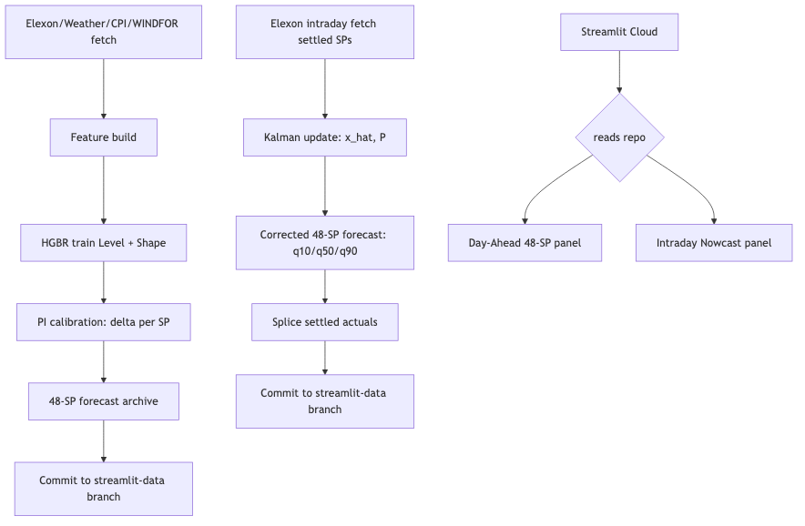
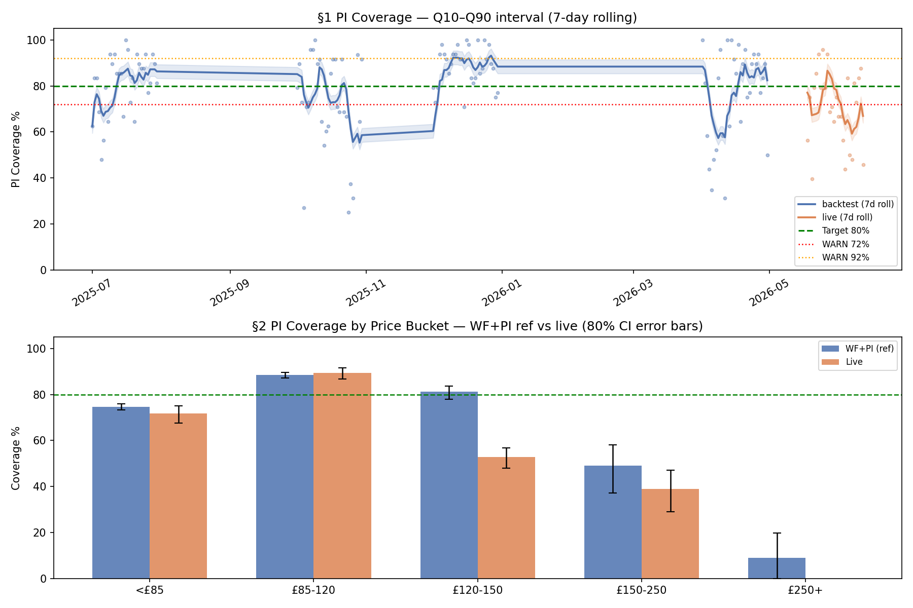
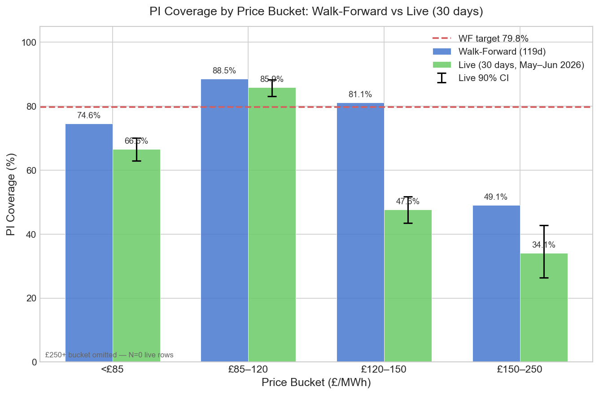
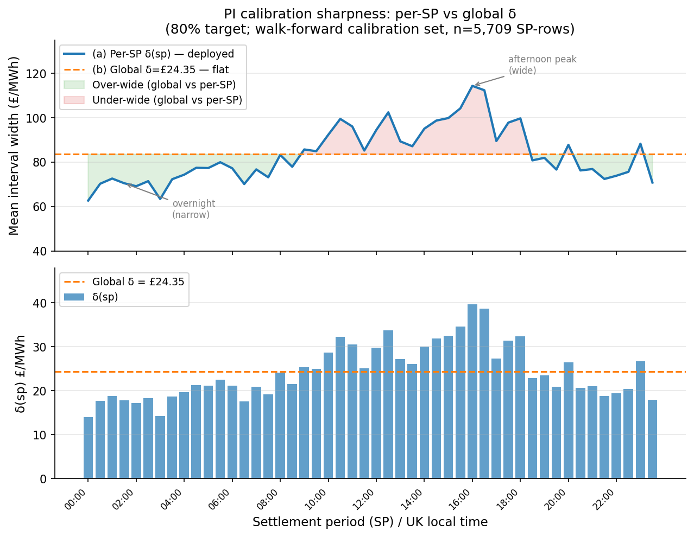
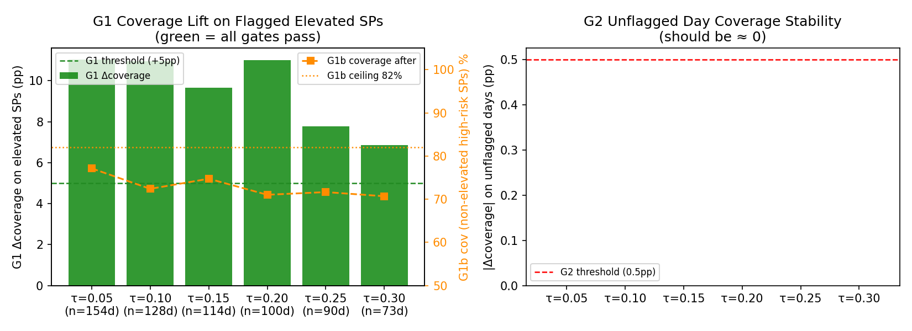
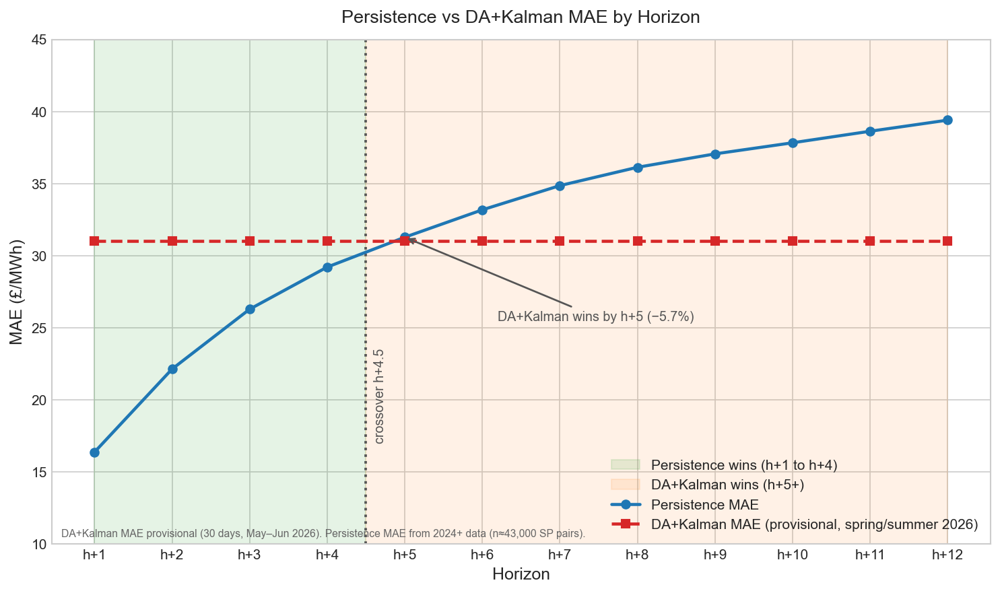
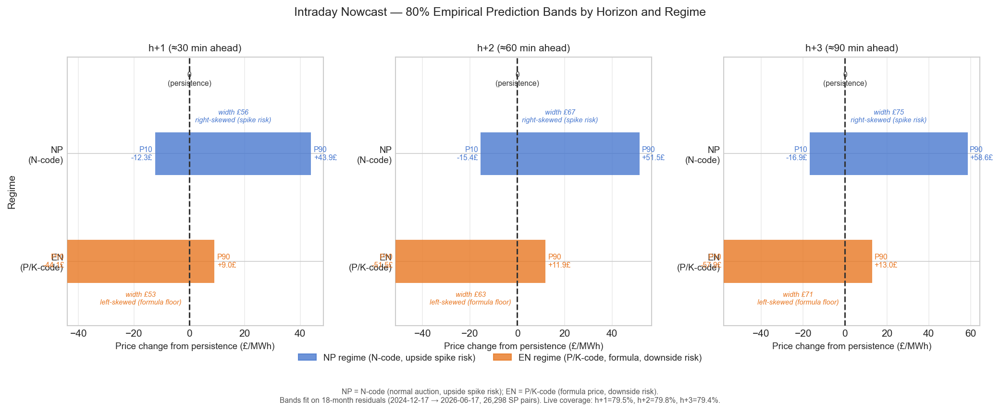
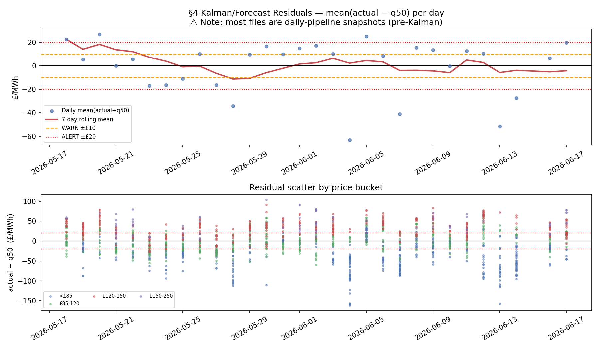
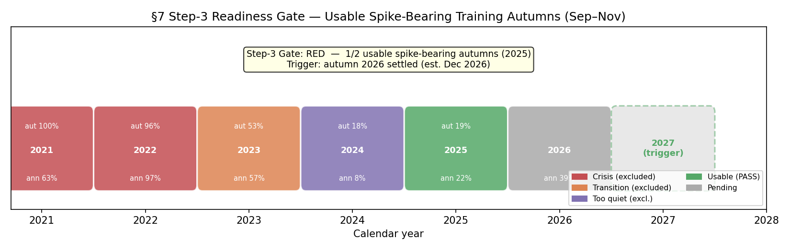

# UK Electricity System Sell Price Forecasting System: Technical Report

**Branch:** streamlit-data  
**Date:** 2026-06-21  
**Status:** Live production system  

---

## Abstract

This report describes an automated system for forecasting the UK electricity System Sell Price (SSP), the mechanism-derived imbalance price paid by market participants who are short relative to their contracted position in each 30-minute settlement period. The system delivers a 48-SP day-ahead profile forecast updated daily at 12:30 UTC, a live intraday Kalman correction layer updated every 30 minutes, calibrated 80% prediction intervals (PIs), and an intraday persistence nowcast for h+1 through h+3. The primary accuracy benchmark is a walk-forward (WF) MAE of £28.96/MWh (StaticBase, raw uncorrected model) over 119 days and 4 seasonal folds; the deployed Kalman corrector achieves £27.68/MWh. The headline achievement of Phase 4 is PI coverage: split-conformal per-SP calibration lifted the walk-forward coverage from 37.99% (uncalibrated HGBR bands) to 79.82%, representing the difference between unusable and commercially deployable uncertainty quantification. A Kalman level-correction filter replaces a hand-tuned flat-alpha heuristic with principled NIS-auditable bias correction and adds +4.5 percentage points (pp) of PI coverage over the static base. Live day-ahead PI coverage is 66.0% over 30 days (spring/summer only, N=1,418 SP-rows), 13.8pp below target and under active monitoring. The intraday persistence nowcast achieves a separate 79.4–79.8% live coverage via regime-asymmetric empirical bands (§8, §12.3). A rigorous persistence-vs-DA crossover analysis found that DA+Kalman adds no value for h+1 to h+4, and the HGBR nowcast prototype was 17% worse than persistence at h+1; neither was shipped. Spike-tail widening (Phase 6a) passes all gating tests but is currently config-OFF pending manual sign-off.

---

## 1. Introduction and Business Value

### 1.1 Who Uses SSP Forecasts

The System Sell Price is one half of the UK Balancing Mechanism's imbalance price pair (the other being the System Buy Price, SBP). Any market participant — a generator, a battery storage operator, an industrial consumer, or a trading desk — that closes a settlement period with an imbalance relative to their contracted position either pays SBP (if long) or is paid SSP (if short). SSP forecasts at 30-minute resolution are used directly by:

- **Intraday traders** managing residual imbalance exposure as the settlement period approaches
- **Battery dispatch systems** optimising charge/discharge decisions against the expected imbalance cost
- **Portfolio risk desks** computing value-at-risk for positions exposed to balancing mechanism prices
- **Hedging desks** structuring derivative products whose settlement depends on SSP realisation

The 48-SP daily profile (forecasting all 30-minute slots for the next day) is the minimum resolution required by dispatch optimisation systems. Intraday updates as SPs settle within the day allow these systems to revise their position before the remaining SPs close.

### 1.2 Why SSP is Harder to Forecast than Day-Ahead Market Prices

The UK SSP is mechanistically derived — it is not set by a transparent exchange auction but by the National Grid Electricity System Operator (NGESO) Balancing Mechanism, which dispatches fast-responding units (gas peakers, batteries, demand response) to maintain system balance in real time. The price-derivation code governs the price mechanism:

- **N-code (NP, normal price)**: price set via the Net Imbalance Volume (NIV) weighted average of bids and offers accepted in the BM. Correlated with imbalance direction and market tightness.
- **P-code (EN, energy not balanced)**: formula-derived price applied when the BM stack is exhausted or the system enters certain constraint conditions. Typically a function of administered reference prices; prices can go sharply negative during renewable oversupply.
- **K-code**: default/administered price; similar to P-code.

This mechanism structure creates two challenges absent from day-ahead market prices: (1) sharp, unpredictable price spikes when BM reserve is exhausted (autumn 2025 saw one SP reaching £487/MWh), and (2) structural negative prices during renewable oversupply events under P/K-code (June 2026 saw midday prices as low as −£70/MWh). Neither of these is forecasted well by standard time-series or gradient-boosted models, because both are triggered by real-time physical conditions that are not yet settled at the day-ahead lag.

### 1.3 Commercial Value of Calibrated Uncertainty Bands

The difference between 38% and 80% PI coverage is not a modelling nuance — it is the difference between two entirely different risk management regimes. At 38% coverage, a quoted 80% PI is narrower than a flat unconditional confidence interval and gives a false sense of precision; a risk manager sizing capital against such bands will be catastrophically wrong 62% of the time rather than 20%. At 80% coverage, the PI is actionable: a battery operator can size their risk reserve, a trader can bound their tail exposure, and a hedging desk can quote a credible spread.

The system achieved this coverage improvement via split-conformal per-SP calibration, not via a better point model. This distinction is explicit throughout the report.

### 1.4 The Discipline of Non-Shipment

One of the most commercially important outputs of this system is the set of models that were **not** built. The persistence-vs-DA crossover analysis produced explicit, quantified evidence that a DA model adds no value at h+1 through h+4, preventing a large engineering investment in a model that would have regressed live accuracy. The HGBR nowcast prototype was built and evaluated honestly: at h+1 it was 17% worse than simply repeating the last settled price. Both of these decisions — and the AlphaCorrector HOLD pending Kalman validation, and the Brier-skill-zero spike classifier — are documented with precise numbers and retained as evidence. The system accrues no technical debt from optimism.

### 1.5 Scope

The production system covers:

- Day-ahead 48-SP SSP profile forecasts (daily HGBR retrain at 12:30 UTC)
- Intraday Kalman level correction (every 30 minutes, updating as SPs settle)
- Calibrated 80% PIs via split-conformal per-SP conformity widening
- Persistence nowcast for h+1/h+2/h+3 with regime-asymmetric empirical bands
- Active research: spike-tail PI widening (Phase 6a, config-OFF), nowcast model development

### 1.6 Where the Commercial Value Sits by Horizon

Not all forecast horizons are equally actionable. The commercial value of SSP forecasting is concentrated at **h+4 and beyond**, for two mutually reinforcing reasons.

**Reason 1 — this is where the model carries genuine information.** As established in §8, persistence (repeating the last settled SP) is the superior predictor at h+1 through approximately h+4. The DA+Kalman model only overtakes persistence around h+4.5, and by h+5 it beats persistence by roughly 5–6%. Deploying the model at shorter horizons would actively regress accuracy; the short-horizon forecasts in production are persistence-based for this reason. The crossover is not an inconvenience — it is a map of where the forecast adds value.

**Reason 2 — the decision window.** In GB electricity markets, participants can adjust their positions in the intraday market until roughly an hour before delivery. An h+1–h+2 view (30–60 minutes ahead) arrives at or past the point where most positions can be practically changed. A view at h+4 and beyond provides a 2+ hour lead time during which adjustments, trades, and dispatch decisions remain available.

Together, these reasons define four primary use cases where the day-ahead 48-SP forecast (backed by calibrated PIs) delivers actionable value:

1. **Intraday trading and cash-out avoidance.** A participant expecting to be short (or long) at delivery can trade out of — or into — an imbalance position in the intraday market before gate closure. The SSP profile forecast indicates whether the system will be tight (high SSP, expensive to be short) or loose (low or negative SSP, costly to be long), driving the trade direction. The lead time needed to execute this is precisely the h+4+ window.

2. **Battery and flexible-asset dispatch.** Battery operators and flexible-load managers schedule charge/discharge against the expected intraday price profile. This requires the full 48-SP shape (when will SSP be high? when low?) and meaningful lead time for scheduling. The Level–Shape architecture — which produces a day-ahead profile at 30-minute resolution — is specifically suited to this use case, and it is where the model's performance advantage over simple baselines matters most.

3. **Imbalance hedging and risk management.** Risk desks managing exposure to balancing mechanism cash-out need to estimate expected cost and value-at-risk over the remaining settlement periods of the day. This is where the calibrated PI bands (§5) pay off directly: a 79.8% PI is actionable for bounding tail exposure and sizing reserve capital. A raw 38% PI — the uncalibrated output — is systematically narrower than the true distribution and would lead to structural under-hedging.

4. **Flexible generation and BM unit commitment.** Peakers, CCGTs, and demand-response units need to make availability and bid-price decisions that take effect at a future SP. A well-calibrated SSP forecast informs whether it is profitable to be in the BM at a given price and time.

**Contrast: h+1–h+3 as situational awareness.** The persistence nowcast (§8.5) provides an h+1/h+2/h+3 view with regime-asymmetric empirical bands. This is useful for real-time monitoring — watching whether the system is drifting toward a high-price regime, tracking the Kalman state — but it is largely past the point of action for most structured decisions. It is provided as cheap, accurate situational awareness, not as a decision-driving forecast.

This horizon segmentation is what motivates the system's architecture: a DA+Kalman model for the actionable window (h+4+), and a persistence nowcast for the awareness window (h+1–h+3). The crossover analysis in §8 provides the quantitative grounding for this split.

---

## 2. Data and the Lag Ceiling

### 2.1 Data Sources

The system ingests from five external sources on each daily pipeline run:

- **Elexon BMRS REST API**: SSP, SBP, NIV, sell/buy price adjustments, and price derivation codes for each 30-minute settlement period. The settlement data endpoint (`/balancing/settlement/system-prices/{date}`) requires no authentication and provides Initial Settlement data with approximately a 30-minute publication lag after each SP closes.
- **Open-Meteo**: day-ahead weather forecasts (temperature, wind speed, solar irradiance) at UK grid locations
- **BMRS WINDFOR**: National Grid ESO day-ahead wind generation forecast
- **BMRS TSDF**: Transmission System Demand Forecast (boundary `N` when available)
- **ONS CPI**: monthly consumer price index, used for CPIH deflation of training targets

The historical training dataset covers **87,686 SP-rows across 1,827 days (May 2021 – May 2026)**, held in `data/processed/dataset_5yr.csv`. At 48 SPs per day, this constitutes approximately 5 full calendar years of 30-minute imbalance pricing.

### 2.2 The Lag Ceiling for Day-Ahead Forecasting

The fundamental constraint on feature engineering is the publication delay. Elexon publishes Initial Settlement data approximately 30 minutes after each SP closes. By the daily pipeline run time of 12:30 UTC, approximately settlement periods 1–25 (00:00–12:30 BST) are available — roughly 52% of the current day. This creates the **lag ceiling**: a feature derived from SP[t] is not available until SP[t] has settled, which is at least 30 minutes after SP[t] closes.

For the day-ahead 48-SP forecast (predicting all SPs on day D+1, generated on day D), the lag constraint is even stricter: all features must be lagged by at least 48 SPs (one full day) to be leakage-free for every one of the 48 forecast SPs. This means the shape model for SP 1 on day D+1 must use features from day D−1 or earlier. Rolling windows of the form `shift(1).rolling(w)` are excluded from the shape model because they contaminate SPs 2–48 with information from SPs 1–(w−1) of the same day.

### 2.3 The 2022 Energy Crisis as a Structural Break

Annual spike rates in the dataset show a dramatic structural regime change:

| Year | Annual spike rate (>£150) |
|------|--------------------------|
| 2022 | 96.7% |
| 2023 | 57.3% |
| 2024 | 7.7% |
| 2025 | 22.5% |

The 2022 energy crisis inflates spike frequencies by more than an order of magnitude compared to the 2024 regime. Including 2021–2022 data would bias the model's mean level and spike-risk priors toward an aberrant historical regime. The training window is therefore set to 3 years (`TRAIN_YEARS=3`), which as of mid-2026 covers approximately mid-2023 onwards. This window excludes the 2021–2022 crisis years but still includes the elevated-volatility 2023 tail (annual spike rate 57.3%); those 2023 rows are present in training and influence the model's uncertainty estimates. The WF evaluation window (2025-07-01 to 2026-04-30) falls entirely within the rolling 3-year window and is used as the PI calibration reference.

### 2.4 Lag Ceiling for Intraday Nowcasting

For the intraday nowcast (predicting SP[t] at horizon h+1 during the current settlement period), the hard ceiling is the publication lag: SP[t] itself is not yet settled at forecast time. The most recent available observation is SP[t−1]. The SSP series exhibits near-AR(1) dynamics (ACF lag-1 = 0.828, PACF near-1 at lag-1 and approximately zero at lags 2–6), which means persistence — predicting SP[t] = SP[t−1] — is the Bayes-optimal linear predictor at h+1 given this autocorrelation structure.

---

## 3. Pipeline Architecture

### 3.1 End-to-End Flow



**Daily pipeline (12:30 UTC, `daily_pipeline.yml`):** Fetches all data sources, builds the feature matrix via `build_features.py`, retrains both HGBR models (level P10/P50/P90, shape H+1 and H+2), runs split-conformal PI calibration and writes `pi_calibration_v1.json`, writes the day-ahead 48-SP forecast archive, and commits all artifacts to the `streamlit-data` branch.

**Intraday pipeline (every 30 minutes, 48 runs per day, `intraday_update.yml`):** Inference-only — the frozen HGBR models are not retrained. Fetches the latest settled SPs, updates the Kalman state (`x̂`, `P`), applies the horizon-decayed correction, splices confirmed actuals into the forecast CSV, and commits the updated state and forecast if any content has changed.

**Dashboard:** Streamlit Cloud reads the `streamlit-data` branch on every request. The Day-Ahead panel shows the 48-SP profile with PI bands; the Intraday Nowcast panel shows persistence point forecasts and asymmetric empirical bands for h+1/h+2/h+3.

### 3.2 State Persistence and Cold-Start Safety

GitHub Actions runners are ephemeral: they are destroyed after each workflow run. Without state persistence, the Kalman filter would cold-start at `x̂=0`, `P=P₀` on every run, discarding the accumulated intraday information. The system solves this by writing `model_assets/kalman_state.json` to the `streamlit-data` branch after every intraday update. On each subsequent run, the runner reads this file as its initial state. The 7-day GitHub Actions cache eviction — which would wipe a cached file — does not apply to committed repository content. This is the key architectural decision that makes the Kalman filter viable in a serverless CI/CD environment.

### 3.3 Production Safety Mechanisms

Four guards prevent bad output from reaching the dashboard:

1. **PI calibration guard** (`_assert_pi_calibrated()`): raises `RuntimeError` at forecast time if the output CSV's quantile spread is statistically consistent with uncalibrated bands (standard deviation of `q90−q10` matches the pre-calibration pattern). This closes the specific failure mode that shipped raw 38% bands prior to 2026-06-17.

2. **Archive write guard**: the daily forecast archive is written only when no settled actuals are present in the forecast CSV. This ensures the archive contains clean model output, not a mix of actuals and model predictions.

3. **Kalman z-guardrail**: if the computed innovation `z_t = mean(actual − q50)` exceeds ±£500/MWh, the Kalman update is skipped. This rejects Elexon data anomalies (erroneous Initial Settlement rows) without contaminating the filter state.

4. **Idempotency guard**: if the new commit would produce identical file contents to the current `HEAD`, no commit is made. This prevents spurious empty commits from polluting the branch history when no new SPs have settled.

---

## 4. Modelling: Level–Shape Decomposition

### 4.1 Motivation

A direct HGBR model predicting SP-level SSP would compound two distinct sources of error: errors in the daily mean level (which requires understanding energy-market supply/demand balance, weather, and fuel prices), and errors in the intraday shape (which requires understanding the hour-by-hour load pattern and generation mix). The level–shape decomposition separates these into two models with independent feature sets, enabling tighter control over leakage and independent evaluation of each stage.

### 4.2 Stage 1 — Level Model

**Target:** `ssp_raw_daily_mean` — the arithmetic mean of all 48 raw (pre-winsorisation) SSP values on day D.

**Features:** 84 features from `model_assets/level_feature_cols.json`, including: SSP and NIV rolling statistics at multiple lags (1d, 2d, 7d, 30d), calendar harmonics (sin/cos of day-of-year, day-of-week), day-ahead weather (temperature, wind speed, solar irradiance), BMRS WINDFOR wind penetration percentage, ONS CPIH deflation factor, spike count lags, and the output of the negative-price regime classifier.

**Model:** Quantile HGBR (`HistGradientBoostingRegressor`) with three heads: P10, P50, P90 (pinball loss for each). Training window: 3 years rolling. CPIH deflation applied to targets so the model learns the deflated price process; re-inflated at inference.

**Lag guarantee:** All features reference data before day D starts — zero-leakage for all 48 day-ahead forecast SPs.

### 4.3 Stage 2 — Shape Model (H+1 and H+2)

**Target:** `ssp_raw_h − actual_daily_mean_D` — the deviation of SP h's actual price from the day's actual mean. This centres the shape around zero, which is better conditioned for the HGBR (the model does not need to learn the level).

**Features (H+1):** 74 features from `model_assets/shape_feature_cols.json`, using fixed-point lags only (lag ≥ 48 SPs: lag-48, lag-96, lag-336 for SSP, NIV, weather, and wind penetration). Rolling windows (`shift(1).rolling(w)`) are **strictly excluded** — a feature like the 7-day rolling mean of SP 24's SSP would use SP 24 from the current day when computing features for SP 25, constituting leakage.

**Features (H+2):** 50 features from `model_assets/shape_h2_feature_cols.json`, with lag ≥ 96 SPs (today's settled prices are not yet available at H+2 lag).

**Model:** Single-head P50 HGBR. Only median prediction is needed for the shape deviation; the PI calibration layer handles the uncertainty widening.

**Combination:** The final day-ahead forecast for SP h is `q50_level + q50_shape_h`, with q10/q90 obtained by combining the level quantiles with the shape deviation and then applying per-SP conformal widening.

### 4.4 Negative-Price Regime Classifier

A binary HGBR classifier is trained to predict `P(≥3 negative-price SPs tomorrow)`. Its output probability is injected as the 84th feature in the level model. Negative-price events (driven by renewable oversupply under P-code) are distinct enough from normal market dynamics that a dedicated flag materially improves level forecasts on days when overnight or midday prices go deeply negative.

### 4.5 Model Results

**Walk-forward MAE (primary, 119-day WF window, 4 folds):** £28.96 (StaticBase, from the corrector backtest). This is the fair comparison figure — it covers summer, autumn, winter, and spring folds.

**7-day test MAE: £32.03** (RMSE £42.46, n=336 SP-rows). Source: `model_assets/phase3_metrics.json`. This figure is inflated by the June 4, 2026 extreme renewable oversupply event, which drove midday SSP to approximately −£70/MWh and produced 10 negative-price SPs in a single day. WF MAE (£28.96) is the primary performance metric.

> **sMAPE caveat.** The sMAPE on this 7-day window is 49.61%. SSP frequently touches near-zero or negative values (as in the June 4 event), which inflates the sMAPE denominator term `(|actual| + |predicted|)/2` toward zero and causes the ratio to explode. sMAPE is not a reliable metric for this price series; it is reported for completeness only. MAE and RMSE are the operative accuracy figures.

Decomposition metrics for the same 7-day window:

| Metric | Value |
|--------|-------|
| Level MAE | £18.41/day |
| Shape correlation (mean) | 0.4275 |
| Peak timing MAE | 6.71 SPs |

**Seasonal folds (KalmanCorrector, 119-day WF corrector backtest):**

| Fold | MAE |
|------|-----|
| Summer 2025 | £25.77 |
| Autumn 2025 | £30.50 |
| Winter 2025 | £20.27 |
| Spring 2026 | £34.28 |

**Baselines (7-day test window):**

| Baseline | MAE |
|----------|-----|
| Naive (t−48, last observed same SP) | £36.34 |
| Seasonal naive (t−336, same time last week) | £29.40 |
| Rolling mean 24h | £26.78 |
| Phase 3 model (7-day test) | £32.03 |

Phase 3 underperforms rolling mean 24h on the 7-day test window due to the June 4 extreme event. The WF corrector backtest (£28.96 vs seasonal naive £29.40) gives the fairer comparison across 119 diverse days.

---

## 5. Prediction Interval Calibration (Phase 4)

### 5.1 The Problem

The raw HGBR P10/P90 quantile heads achieve only **37.99% empirical coverage** over the 119-day walk-forward calibration window (5,709 SP-rows). This is the pre-calibration result from `model_assets/pi_calibration_v1.json`. The model's uncertainty bands are too narrow by roughly a factor of two — the HGBR is overconfident, as is common for gradient-boosted quantile models on heteroscedastic financial time series.

At 38% coverage, the PI is not usable for risk management. A quoted "80% interval" that contains only 38% of outcomes is worse than a uniform distribution over a wider range: it conveys false precision about which outcomes are likely.

### 5.2 Method: Split-Conformal Per-SP δ(sp)

The calibration method is split conformal prediction applied independently to each of the 48 settlement positions. For each SP position sp (1 to 48):

1. Compute the conformity score for each row in the 4-fold walk-forward calibration set:
   ```
   score(sp, day) = max(q10_sp - actual_sp, actual_sp - q90_sp)
   ```
   A positive score means the actual price lies outside the raw [q10, q90] band. A score of £10 means the band needs to widen by £10 on the violated side to capture this observation.

2. Compute the SP-specific calibration offset:
   ```
   δ(sp) = 80th percentile of {score(sp, day)} over all 119 WF days
   ```

3. Apply the widening symmetrically:
   ```
   q10_cal(sp) = q10(sp) − δ(sp)
   q90_cal(sp) = q90(sp) + δ(sp)
   ```

The choice of 80th percentile targets 80% coverage by construction (split conformal theory guarantees that on average, at least 80% of held-out observations will fall within [q10_cal, q90_cal] under exchangeability).

**Achieved in-sample coverage:** 79.82% per-SP, 80.00% global — on target. This is recorded in `model_assets/pi_calibration_v1.json`.

### 5.3 The δ(sp) Profile

The per-SP calibration offsets range from **£13.95 at SP 1 (00:00–00:30)** to **£39.74 at SP 33 (16:00–16:30)**. This is not a quirk of the calibration procedure — it reflects the known intraday volatility structure of UK electricity dispatch:

- SPs 1–7 (overnight): low demand, generation mix stable, SSP near day-ahead reference price. Small model errors → small δ.
- SPs 32–40 (afternoon peak, ~16:00–20:00): demand ramp, evening peak, wind uncertainty, BM stack most active. Largest model errors → largest δ.

Summary statistics: median δ = £22.75; P25/P75 = £19.41/£28.99; global reference δ = £24.35.

### 5.4 The Production Guard

The calibration bug that shipped raw 38% bands prior to 2026-06-17 was closed by adding a runtime assertion `_assert_pi_calibrated()` that checks the spread characteristics of the output forecast CSV before committing. The guard raises `RuntimeError` if the standard deviation of `q90−q10` matches the uncalibrated band pattern. A secondary sentinel in the walk-forward pipeline raises `RuntimeError` if `walk_forward_predictions.csv` is present but `pi_calibration_v1.json` is absent — the calibration step cannot be silently skipped.

The test suite covers an 8-scenario (A–H) matrix of PI guard conditions, including the exact failure mode that occurred in production.

### 5.5 Live Coverage

Over the 30 days from 2026-05-18 to 2026-06-17 (1,418 SP-rows), live **day-ahead PI** coverage is **66.0%** (90% CI: [63.9%, 68.0%]) — 13.8pp below the WF target of 79.8%. This is a live regression and is classified as an open issue. This figure is distinct from the intraday nowcast band coverage (79.4–79.8% live across h+1–h+3, reported separately in §8.5 and §12.3); the nowcast uses independently fitted empirical bands, not the HGBR PI.

Caveats: (1) the 30-day live window covers spring/summer only — a period that may have different price dynamics than the autumn/winter folds in the WF calibration; (2) the live CSV files were backfilled with PI calibration applied retroactively on 2026-06-17; files from 2026-06-17 onwards have calibration applied at generation time; (3) the small sample (N=1,418) means the 90% CI spans 4pp, so the true long-run live coverage may differ from the 30-day estimate. Investigated in the weekly monitoring loop.





### 5.6 Coverage Is Not Enough — Sharpness and the Interval Score

A band that covers 80% of outcomes but is £1,000 wide in every period is useless. Coverage alone is trivially gameable: an infinitely wide band achieves 100% coverage at the cost of zero information. Forecast intervals are therefore evaluated jointly on **coverage and sharpness** (average band width) via a proper scoring rule that penalises width.

**The interval (Winkler) score** for an 80% PI (α = 0.2) is:

```
IS = (q90_cal − q10_cal)  +  (2/α) × [max(q10_cal − y, 0) + max(y − q90_cal, 0)]
   = width  +  10 × violation_penalty
```

A violation below the lower bound or above the upper bound is penalised at 10× the width cost per unit. This means the score strictly rewards narrower bands that still cover, and punishes bands that are wide but still miss. It is equivalent to twice the sum of the q10 and q90 pinball losses.

**δ(sp) is minimal by construction.** The split-conformal recipe sets δ(sp) to the 80th percentile of the per-SP conformity score distribution. Any smaller δ fails to reach 80% marginal coverage; any larger δ increases width without improving coverage. The 80th percentile is the tightest choice consistent with the coverage target under exchangeability.

**Computed comparison on the walk-forward calibration set** (n = 5,709 SP-rows, 119 days, four seasonal folds):

| Band | Empirical coverage | Mean interval width | Interval score (α=0.2) | Mean pinball (q10+q90) |
|---|---|---|---|---|
| **(a) Per-SP δ(sp)** — deployed | **79.8%** | £83.56 | **£125.39** | £12.54 |
| (b) Single global δ = £24.35 | 80.0% | £83.58 | £127.41 | £12.74 |
| (c) Fixed-width q50 ± £41.75 | 80.0% | £83.49 | £128.56 | £12.86 |
| (0) Raw HGBR (no calibration) | 38.0% | £34.89 | £172.85 | — |

Bands (b) and (c) achieve 80.0% coverage — fractionally above the per-SP target. The mean widths of all three calibrated bands are nearly identical (within £0.10), because the global δ (£24.35) is the unweighted mean of the per-SP δ values. The aggregate amount of width added is the same across methods; the difference is how it is allocated.

The per-SP band has the lowest interval score (£125.39 vs £127.41 for global, £128.56 for fixed-width) despite matching mean width. The reason is allocation: δ(sp) concentrates width where violations are likely and removes it where they are not. The global δ of £24.35 **over-widens overnight SPs by £10–21** (wasted width that earns no coverage credit) and **under-widens afternoon peak SPs by £5–31** (insufficient to avoid violations that are penalised at 10×). The fixed-width band commits the same mismatch even more severely by ignoring the HGBR spread variation entirely.



*Figure: top panel — mean interval width by SP for the deployed per-SP band (blue) vs the global δ flat baseline (orange dashed); green shading = global over-widens, red shading = global under-widens. Bottom panel — the δ(sp) profile (£13.95 SP 1 to £39.74 SP 33) vs the global reference line.*

**Kalman widening note.** The Kalman intraday corrector applies an additional uncertainty widening of ±1.28·√P·γ^h where P is the posterior variance and γ^h is the horizon decay factor. Unlike the fixed conformal offset, this widens dynamically as the filter's state uncertainty grows (P increases between settled SPs) and shrinks as each new SP settles and reduces P. It is not a fixed pad — it is proportional to the filter's current epistemic uncertainty and decreases monotonically with the number of settled SPs.

**Honest caveat.** The per-SP conformal band achieves **marginal** 80% coverage under the exchangeability assumption — meaning coverage is ~80% averaged across all SP positions over the calibration distribution. It does not achieve 80% conditional on every subset: the live analysis (§5.5) shows 66% coverage on the 30-day live window, and §7 documents systematic under-coverage in the elevated-price tail (>£120). These are known regime mismatches — the calibration set's seasonal mix may differ from the live window, and the symmetric conformal offset cannot adapt to the right-skew of high-price SPs. The interval score comparison here is on the calibration folds themselves; live IS will differ.

---

## 6. Intraday Kalman Level Correction (Phase 4)

### 6.1 Motivation

The day-ahead HGBR level model carries a slowly-drifting daily bias — some days it systematically over-predicts, others it under-predicts, driven by factors not captured at the D−1 lag (intraday generation dispatch changes, last-minute outages, demand revisions). As SPs settle during the day, the difference between actuals and model predictions is an observable signal that can be used to correct the remaining unsettled SPs.

The previous correction (AlphaCorrector) computed the mean forecast error over settled SPs and applied 40% of it as a flat shift to all unsettled SPs: `correction = 0.4 × mean(actual − q50)`. This has three weaknesses: (1) it has no memory across intraday calls — each run discards the previous call's estimate; (2) it ignores observation noise — a single noisy SP contaminates the correction as much as a dozen; (3) it applies uniform correction regardless of how far ahead in the day, when far-future SPs are less correlated with current conditions.

### 6.2 The Kalman Filter Design

The state is a scalar bias estimate `x̂` (random-walk prior), updated as each SP settles. The filter runs as follows at each 30-minute intraday call:

**Observation:** After fetching settled SPs, compute the mean innovation:
```
z_t = mean(actual[sp] − q50[sp]) for settled SPs
```

**Predict step:**
```
x̂⁻ = x̂_{t-1}
P⁻  = P_{t-1} + Q
```

**Update step:**
```
R_t = σ²_SP / n_t        (observation noise shrinks as more SPs settle)
K_t = P⁻ / (P⁻ + R_t)   (Kalman gain: 0 = ignore, 1 = trust fully)
x̂_t = x̂⁻ + K_t × (z_t − x̂⁻)
P_t = (1 − K_t) × P⁻
```

**Correction with horizon decay:**
```
correction(h) = x̂_t × γ^h
```

where h is the number of SPs ahead of the last settled SP. The decay factor γ=0.966 per SP means the correction halves by approximately SP+20 (~10 hours ahead) and decays to near-zero at far horizons. This is motivated by the known fact that the intraday bias is driven by transient regime conditions that resolve within hours, not systematic day-wide errors.

**Deployed parameters** (from `model_assets/corrector_config.json`):
- Q = 21.0 £² (process noise variance, consistent with theoretical derivation from level MAE ≈ £13/day, implying per-step drift Q ≈ (£13/√8)² ≈ 21 £²)
- σ_SP = 35.0 £ (per-SP observation noise, consistent with SP-level MAE ≈ £29)
- γ = 0.966 per SP (horizon decay)
- z_guardrail = ±£500/MWh (anomaly rejection)

**PI widening:** The Kalman uncertainty `P_t` propagates to widen the PI envelope:
```
σ²_correction(h) = P_t × γ^(2h)
```

The correction is added to q50, q10, and q90. Early in the day (few SPs settled, large `P_t`), the PI widens to reflect uncertainty in the bias estimate. Late in the day (many SPs settled, small `P_t`), the PI narrows. This is the principled uncertainty propagation that distinguishes the Kalman filter from the flat-alpha heuristic.

**Daily reset:** At midnight UTC (or when a new `forecast_date` is detected), the filter resets to `x̂=0`, `P=P₀=σ²_SP=1225`. No cross-day contamination.

### 6.3 NIS Tuning

The Normalised Innovation Squared (NIS) is the standard diagnostic for Kalman filter calibration: a well-calibrated filter has `E[NIS] = 1`. The NIS was measured over the 119-day WF window, sweeping Q and σ_SP.

**NIS-tuned parameters:** Q=5.0 £², σ_SP=20.0 £ → mean NIS = 0.671 (MIXED: the filter is over-confident overall, but with strong seasonal heterogeneity).

| Fold | Mean NIS | Calibration |
|------|----------|-------------|
| Summer 2025 | 0.404 | Under-confident |
| Autumn 2025 | 0.596 | Under-confident |
| Winter 2025 | 0.319 | Under-confident |
| Spring 2026 | 1.364 | Over-confident |

The spring fold is much harder: the filter is over-confident (innovations are smaller than predicted), while winter and summer are under-confident (innovations are larger). A single (Q, σ_SP) cannot simultaneously calibrate all regimes, which is a known limitation of a scalar level-only filter with fixed parameters. The deployed Q=21.0 is looser than the NIS-optimal Q=5.0, reflecting the theoretical derivation from level MAE. The NIS heatmap (below) illustrates the seasonal heterogeneity.


### 6.4 Backtest Results

| Corrector | MAE | PI Coverage |
|-----------|-----|-------------|
| StaticBase (raw model) | £28.96 | 37.7%¹ |
| AlphaCorrector (α=0.4) | £27.63 | 38.9% |
| KalmanCorrector (deployed) | £27.68 | 42.2% |

¹ The corrector backtest measures 37.7% on unsettled SPs only (the subset evaluated in the corrector harness). `model_assets/pi_calibration_v1.json` records 37.99% over all 5,709 WF rows — a 0.3pp difference from evaluation scope, not a methodological discrepancy. Both figures are pre-calibration.

**Honest framing:** Kalman and Alpha are statistically tied on point-forecast MAE (£27.68 vs £27.63, a difference of £0.05 — less than 0.2%, within noise). The backtest gate at Section 1 of the corrector report is therefore labelled HOLD on point-accuracy grounds. **Do not interpret Kalman as improving point accuracy over Alpha.**

Kalman adds **+3.3pp PI coverage over Alpha and +4.5pp over StaticBase** (42.2% vs 38.9% vs 37.7%). This improvement comes from the horizon-decay uncertainty propagation: the widened PI envelope early in the day (when `P_t` is large) correctly captures the higher residual spread when fewer SPs have settled. This is the principled advantage of Kalman over Alpha — not point accuracy, but calibrated uncertainty quantification.

Kalman is preferred in production for three reasons: (1) principled uncertainty propagation via `P_t`, (2) NIS-auditable calibration that can be monitored objectively, (3) no hand-tuned scalar α that can drift out of regime without detection.

---

## 7. Spike-Tail Coverage (Phase 6a, Config-OFF)

### 7.1 The Tail Gap

The split-conformal calibration targets 80% global coverage by SP position. It achieves this by computing δ(sp) = 80th percentile of conformity scores — which means the calibration is dominated by the 98.8% of rows where prices are normal (≤£150 proxy). The 1.2% of spike SPs (70/5,709 rows in the WF window, 17/119 spike days, 14.3% of days) receive no special treatment.

The consequence:
- Mean residual on spike SPs: **+£77** (actual far exceeds q50)
- PI coverage on spike SPs with global δ: **14%** (10/70)
- Normal-period mean PI width: £34.9; spike-period: £36.7 — **statistically identical**

The global calibration cannot see the tail. The model has some ex-ante information about elevated prices (mean q50 on spike SPs = £117 vs daily mean ~£85), but no information that the uncertainty is fundamentally larger on those SPs. An emergency dispatch at £487/MWh looks like a £120/MWh SP in the model's uncertainty envelope.

### 7.2 Approach: Classifier-Gated Asymmetric Upper Widening

The spike-tail correction is a two-component intervention:

**Component 1 — Ex-ante spike risk flag:** A day is flagged as elevated-risk if:
```
spike_risk_flag = (elevated_count_lag1d ≥ 5) OR
                  (wind_pct_daily_mean_lag1d < 10% AND month ∈ {9,10,11,3,4,5})
```
This flag uses only D−1 lagged features — no outcome conditioning. Flag prevalence: 43/119 days (36%), with a 2.4× spike rate lift (2.8% vs 1.2% of SPs exceeding £150).

**Component 2 — δ_hi applied to afternoon block SPs:** On flagged days, the upper quantile of afternoon-block SPs {33, 34, 35, 36, 37, 38, 40} is widened by δ_hi = **£93.49** — the 80th percentile of upper-tail conformity scores on elevated-price rows (actual > £120) in the afternoon block. This widens q90 only upward, on the specific SPs and days where spike risk is elevated.

**Note on δ_hi provenance:** The £93.49 value is computed from 191 afternoon-block elevated rows in the 119-day WF window, of which only ~27 have actual > q90 (the "exceedances" pool from which the p80 is estimated). This is explicitly provisional — the estimate is directionally correct (large upper tail widening is needed) but statistically thin. The value will be re-estimated as more data accumulates.

### 7.3 Spike Classifier

A logistic regression classifier with isotonic calibration was trained on 10 features (lagged spike counts, wind penetration, gas penetration, NIV, calendar features) to predict P(spike day). Key metrics:

- **Brier score: 0.1241** vs baseline (base rate²): 0.1224 → **Brier skill score ≈ −0.013**
- **Average precision (AP): 0.332**

The Brier skill score is marginally negative: the classifier performs barely better than always predicting the base rate of 14.3% spike days. This means it is **not a probabilistic predictor** — do not use its output as a calibrated probability.

However, the AP of 0.332 (vs 0.143 for a random ranker at base rate) shows that the classifier **does rank spike days better than random**. At threshold τ=0.20: precision=0.286, recall=0.588, 35 days flagged. This precision-recall profile is sufficient for a gating function (flag high-risk days, apply wider bands) even if the absolute probability is miscalibrated.

A wind-skew caveat applies: the wind feature (`wind_pct_daily_mean_lag1d`) is the CI actual wind penetration at training time, but the BMRS WINDFOR forecast at inference. WINDFOR tends to more accurately forecast wind ramp-downs, making the classifier conservative (flags more low-wind days than the training data would suggest).

### 7.4 Gate Results (τ=0.05)

With δ_hi=£93.49 applied to high-risk SPs on flagged days (τ=0.05, 72 days flagged):

| Gate | Condition | Result | Status |
|------|-----------|--------|--------|
| G1 | +5pp coverage on elevated flagged SPs (actual>£120, SP 33–40) | 85.1% → 96.1% (+11.0pp) | PASS |
| G1b | Sharpness: non-elevated high-risk coverage ≤82% | 77.1% | PASS |
| G2 | No change on unflagged days | +0.00pp | PASS |

Results hold excluding the outlier 2025-10-13 (SP26 at £487, the only Tukey-fence spike in the WF window): G1 gives +10.2pp improvement without that date.

**Current status: config-OFF** (`spike_widening: false` in `model_assets/corrector_config.json`). The gating tests pass; enablement is pending manual sign-off of the gate table by a responsible engineer.



---

## 8. Intraday Nowcasting and Persistence–DA Crossover Analysis

### 8.1 Why Persistence is Hard to Beat

The SSP series in the post-crisis regime (2024+, n≈41,662 SP rows) has a near-AR(1) autocorrelation structure:

| Lag | ACF | PACF |
|-----|-----|------|
| 1 | 0.828 | ≈1.0 |
| 2 | 0.710 | ≈0.0 |
| 3 | 0.610 | ≈0.0 |
| 4–6 | 0.449–0.555 | ≈0.0 |

The PACF = 0 at lags 2–6 is the key result: conditional on SP[t−1], all earlier lags carry zero additional linear information about SP[t]. This is the mathematical signature of an AR(1) process. **Persistence — predict SP[t] = SP[t−1] — is therefore the Bayes-optimal linear predictor at h+1.** Any model adding lag-2+ features is regressing on noise.

A partial R² analysis (Frisch-Waugh projection, 2024+ data) confirms the signal ceiling: ΔSSP momentum (lag1−lag2) has partial R² = 2.8% at h+1, implying an implied MAE reduction of only £0.23 (1.4%). All intraday signals combined have an upper bound of ≈£0.65 MAE reduction (3.9%) at h+1 — below the 5% ship gate.

### 8.2 Persistence MAE Decay Profile

Measured on 2024+ data (n≈43,149 SP pairs):

| Horizon | Persistence MAE |
|---------|----------------|
| h+1 | £16.38 |
| h+2 | £22.14 |
| h+3 | £26.29 |
| h+4 | £29.21 |
| h+5 | £31.28 |
| h+6 | £33.18 |
| h+7 | £34.86 |
| h+9 | £37.10 |
| h+12 | £39.40 |
| h+24 | £39.54 |
| h+48 | £37.23 |

The profile shows steep decay from h+1 to h+6 (the autocorrelation half-life is approximately 3–4 SPs), then flattening at ~£39–40 from h+9. The dip at h+48 (£37.23) reflects the 24-hour diurnal autocorrelation: SP[t] at 14:30 today is more correlated with SP[t−48] at 14:30 yesterday than with SP[t−12] at 08:30 today. "Persistence at h+48" is effectively a same-time-yesterday forecast.

### 8.3 DA+Kalman Crossover (Provisional)

Over the 30-day archive (2026-05-18 to 2026-06-17, spring/summer only), the DA+Kalman MAE is approximately **£31 flat across all horizons** from h+1 to h+12. This flatness is structurally expected: the day-ahead model targets 24-hour-ahead accuracy uniformly across all 48 SPs, and the Kalman correction adjusts the overall level but not the horizon-specific shape.

**Overall crossover: h+4.5.** At h+4 the two forecasts are within 2% of each other (DA 1.9% worse than persistence on the 30-day archive); at h+5, DA beats persistence by 5.7%.

**Time-of-day stratification:**
- Evening (18:00–24:00): DA crosses over at h+3 (ACF lag-1 = 0.559, lowest of any period; persistence error grows faster)
- Overnight (00:00–06:00): DA does not cross over until h+7 or later (ACF lag-1 = 0.753; persistence is very accurate)

**Explicit proviso:** These figures are provisional on 30 days from a single spring/summer season. Autumn and winter are unrepresented. The DA+Kalman MAE may be materially different in spike-prone autumn periods. The crossover horizon estimate is directionally reliable; the specific value should not be treated as a stable production parameter until at least 6 months of archive are available (~November 2026).

**Connection to commercial value (see §1.6).** The crossover at h+4.5 maps directly onto where actionable decisions and P&L live in GB markets. Participants can still adjust intraday positions until roughly an hour before delivery; h+4+ is where lead time remains available and the model carries genuine information advantage over persistence. This is why no short-horizon DA model was built: at h+1–h+4 the DA model would regress accuracy against persistence, and the decision window is too narrow for structured action regardless. The crossover result is not a modelling limitation — it is the quantitative reason the architecture is segmented as it is.

A blend analysis found that a horizon-specific blend (α×DA + (1−α)×persistence) beats both pure endpoints by 8–9% MAE at h+4–h+6 — but only on this 30-day sample. The α estimates (0.49 at h+4, 0.60 at h+5) carry ±0.05–0.08 standard error. The practical recommendation for an interim handoff strategy is: persistence for h+1–h+4, DA+Kalman for h+5+.

### 8.4 HGBR Nowcast Prototype (Not Shipped)

An HGBR prototype using lag features (SSP lags 1–6, NIV lags 1–3, rolling volatility, regime flag, time-of-day, weekday) was evaluated walk-forward on 2024+ data (12-week training window, 2-week eval steps):

| Horizon | Persistence MAE | HGBR MAE | Delta |
|---------|----------------|----------|-------|
| h+1 | £16.59 | £19.40 | **−17.0%** (worse) |
| h+2 | £22.53 | £23.92 | **−6.2%** (worse) |
| h+3 | £26.80 | £26.63 | +0.6% (tied) |

The HGBR **fails the 5% ship gate at h+1 and h+2**. The underlying cause is the near-AR(1) dynamics: the model learns spurious splits on lags 2–6 (PACF ≈ 0) and produces predictions that wander further from the last observation than persistence does.

The prototype was not shipped. It is documented here to show that the evidence against it is explicit and quantified, not the result of a failure to try.

### 8.5 What IS in Production

**Point forecast:** Last settled SP (pure persistence).

**80% empirical prediction bands:** P10/P90 of historical persistence residuals `r_h = SSP[t+h−1] − SSP[t−1]`, fitted on 18 months of data (2024-12-17 to 2026-06-17, 26,298 SP pairs).

**Regime-asymmetric bands:** Bands are fit separately for NP (N-code) and EN (P/K-code) regimes:

| Horizon | Regime | P10 | P90 | Interpretation |
|---------|--------|-----|-----|----------------|
| h+1 | NP (N-code) | −£12.32 | +£43.90 | Right-skewed: upside spike risk |
| h+1 | EN (P/K-code) | −£44.13 | +£9.00 | Left-skewed: formula floor risk |
| h+2 | NP | −£15.45 | +£51.50 | Wider with horizon |
| h+2 | EN | −£51.45 | +£11.95 | |
| h+3 | NP | −£16.86 | +£58.57 | |
| h+3 | EN | −£57.90 | +£13.00 | |

The asymmetry reflects the physical price formation mechanism: NP (normal auction) is right-skewed because imbalance can spike upward when reserve is exhausted; EN (formula) is left-skewed because the formula price acts as a ceiling reference and oversupply drives prices down, not up.

**Day-boundary rollover.** When the current time falls within the last few settlement periods of the trading day (SPs 46–48, i.e. after 22:30), the h+2 and h+3 persistence targets fall on the next calendar day. In these cases the persistence point forecast is still the last confirmed SP, but the denominating day changes: SP 48 + h becomes SP (h−2) of tomorrow. The nowcast panel handles this rollover by tracking the absolute SP index modulo 48 and looking up the appropriate regime bands by horizon (h+1/h+2/h+3), not by absolute SP. The regime flag (NP vs EN) is inherited from the last confirmed SP's price-derivation code; no next-day forecast CSV is required for the nowcast to function across the day boundary.

**Live coverage (2026, N≈3,213–3,215 SP pairs):** h+1 = 79.5%, h+2 = 79.8%, h+3 = 79.4% — all at or near the 80% target, within the 🟡 watch threshold.

Bands are refreshed monthly. The current version was generated 2026-06-18 and is 0 days old.





### 8.6 Reconciling the Nowcast and the Day-Ahead Near-Term

At any point during the trading day, the dashboard simultaneously shows two forecasts for the next few settlement periods: the **persistence nowcast** (point = last settled SP; §8.5) and the **day-ahead near-term** (the Kalman-corrected HGBR q50 for those same SPs; §4–§6). These can differ materially — a settled SP of £120 with a DA q50 of £80 for the next period is not unusual. This is not a system inconsistency; it is a deliberate architectural decision with a quantified basis.

**The disagreement at h+1–h+3 is expected and correctly resolved by the crossover analysis (§8.3; `docs/persistence-ml-crossover.md`).** The key numbers:

| Horizon | Persistence MAE | DA+Kalman MAE | DA/Pers ratio | Operative forecast |
|---|---|---|---|---|
| h+1 | £16.38 | £31.00 | 1.76× **worse** | **Persistence** |
| h+2 | £22.14 | £31.08 | 1.37× worse | Persistence |
| h+3 | £26.29 | £31.11 | 1.15× worse | Persistence |
| h+4 | £29.21 | £31.13 | 1.02× worse (tie) | Persistence or blend |
| h+5 | £31.28 | £31.14 | 0.94× **DA wins** | DA+Kalman |

*(Persistence MAE from 2024+ large-sample data, n ≈ 43,000 pairs; DA+Kalman MAE from 30-day archive, provisional — see §8.3 for caveats.)*

**Why persistence dominates at short horizons.** SSP in the post-crisis regime follows a near-AR(1) process (ACF lag-1 ≈ 0.83, PACF ≈ 0 at all higher lags; §8.1). Persistence — predict SP[t] = SP[t−1] — is the Bayes-optimal linear predictor at h+1 under this structure. The DA+Kalman model produces a structural, diurnal forecast that expects mean reversion toward the day's average level: if the current SP is an outlier (spike or dip), the DA model predicts a return toward the daily profile while persistence predicts the outlier persists. Empirically, **the outlier does persist** long enough that persistence wins for 1–4 SPs (15–120 minutes). The DA model's structural prior only becomes more accurate once the autocorrelation has decayed sufficiently — around h+4.5 on average, and as early as h+3 in the evening when the ACF collapses faster.

**The nowcast and the DA model are not in competition.** They answer different questions:

- **Nowcast (h+1–h+3):** What price is likely *right now*, given the last settled observation? Operative forecast for real-time situational awareness and short-horizon exposure management.
- **DA near-term (h+4+):** What does the day's structural profile imply for prices over the next few hours, given the daily level and shape forecast? Operative forecast for actionable trading and dispatch decisions with ≥ 2-hour lead time (§1.6).

The two diverge most visibly when a regime transition is occurring — for example, when SPs are settling at spike prices but the DA model expects prices to normalise. Empirically the correct response is to trust persistence until the settled SPs confirm the normalisation; at that point the autocorrelation decays and the DA structural forecast becomes more reliable. The crossover analysis provides the quantitative rule for when to switch.

**Dashboard implementation.** The production dashboard now makes this segmentation explicit: the day-ahead chart shades the h+1–h+3 SPs after the last settled price as a "nowcast zone" with a teal overlay, and a caption below the Intraday Nowcast panel states that persistence is the operative h+1–h+3 forecast and the DA near-term is a structural reference that becomes more reliable from approximately h+4 onwards. This avoids the appearance of a contradiction when the two numbers differ.

---

## 9. Testing and Production Reliability

### 9.1 Test Suite

| File | Tests | What it covers |
|------|-------|----------------|
| `tests/test_correctors.py` | 22 | AlphaCorrector byte-identical to inline block; Kalman bias tracking convergence; daily reset; PI widening monotonicity with P |
| `tests/test_kalman_corrector.py` | 20 | Kalman state evolution, horizon decay, edge cases (cold-start, z-guardrail trigger, idempotency guard, daily reset across forecast dates) |
| `tests/test_pi_calibration_guard.py` | 13 | 8-scenario (A–H) matrix: WF-sentinel absent/present, PI JSON absent/malformed/stale, calibrated bands, and boundary cases on the unsettled-SP count threshold |
| `tests/test_pipeline_status.py` | 12 | `_compute_pipeline_status()` freshness and self-consistency checks: unknown/missed/stale/ok states, Rule A (Kalman n > 0 but no `is_actual` rows) and Rule B (CSV ahead of Kalman state) |
| `tests/test_nowcast_rollover.py` | 20 | Day-boundary rollover for SPs 46/47/48; band lookup by horizon not absolute SP; no next-day CSV required |
| `tests/test_build_dataset.py` | 11 | `validate()`, `add_datetime()`, and `derive_base_columns()`: duplicate dropping, missing-period warning, datetime offsets, price-derivation encoding, imbalance volume |
| **Total** | **98** | **98 collected / 98 passed** |

**CI gate:** `.github/workflows/tests.yml` runs `pytest -q` on every push and pull-request to `streamlit-data`. Any collection error (such as the `ImportError` on `derive_features` that silently disabled all 98 tests before 2026-06-21) or test failure fails the build immediately. Install is `numpy pandas pytest` only — no pipeline dependencies — so the gate completes in under 2 minutes including runner spin-up.

### 9.2 Production Reliability

This section documents the operational hardening applied as the system moved from a one-shot research pipeline to an always-on automated service. Each item traces from a discovered failure to its fix and the general lesson.

**Shadow archive management — two bugs, one commit (`b824bdb`).**

*Bug 1 — production archive deleted by shadow run.* The "Restore production forecast files" step in `forecast_pipeline.yml` originally used `rm -f` to clean up the H+1 archive after copying it to the shadow name. Because the subsequent `git add "model_assets/forecasts/"` staged that deletion, every shadow run silently removed the production archive from the branch. `shadow_comparison.py` the next morning found no production archive and the `log.csv` row was never written. Fix: replaced `rm -f` with `git checkout -- "<file>" 2>/dev/null || rm -f "<file>"`. The `git checkout --` path restores the committed production version; `rm -f` fires only as a cold-start fallback when the file was never committed.

*Bug 2 — H+2 archive leaking into shadow commits.* `forecast_phase3.py` writes two archives per run: `forecast_phase3_{TODAY}.csv` (H+1) and `forecast_phase3_{TOMORROW}.csv` (H+2). The shadow pipeline cleaned up H+1 but not H+2, so the H+2 file leaked into shadow commits as an apparent production file, polluting the archive with unreviewed data from a non-authoritative run. Fix: explicitly remove `forecast_phase3_{TOMORROW}.csv` in the restore step — `daily_pipeline.yml` is the sole authoritative source for H+2 archives.

*General lesson: assert the property at the point of damage.* Both bugs were invisible locally; they only manifested in the GitHub Actions commit context. The fix was not adding more unit tests — it was auditing each `git add` scope and verifying that the committed diff matched intent after a real workflow run. For any pipeline that commits back to the repository, the correct verification is to inspect the actual `git diff --staged` content before the commit, not to infer it from the code path.

**Push race prevention — autostash and retry loop.**

All three committing workflows (daily, intraday, shadow) can fire concurrently (a daily retrain at 12:30 UTC overlapping with an intraday update; two concurrent workflow dispatches). Each uses an identical three-attempt retry with autostash:

```bash
for _i in 1 2 3; do
  git pull --rebase --autostash origin streamlit-data && git push && break
  [ "$_i" -lt 3 ] && sleep "$_i"
done
```

`--autostash` stashes any residual working-tree changes (e.g. partially written shadow files) before the rebase and restores them after. The `concurrency: group: streamlit-data-commit` block serialises within a single workflow type; the retry handles races across workflow types.

**Pipeline health monitoring — freshness model and self-consistency assertions.**

`src/dashboard/_pipeline_health.py` provides `_compute_pipeline_status()`, a unified freshness check that the Streamlit dashboard calls on every render. It classifies the pipeline into one of four states: `"ok"`, `"stale"`, `"daily_missed"`, or `"unknown"`. Key thresholds (calibrated against the observed intraday inter-run gap distribution, P95 ≈ 304 min, same-day max ≈ 350 min):

- **Staleness threshold:** 360 minutes. A Kalman state file that has not updated in > 6 hours during the active window (07:00–22:00 UTC) is flagged stale.
- **Daily-missed threshold:** if `forecast_date < today` at or after 14:00 UTC, the daily retrain is assumed to have failed.

Beyond freshness, the function applies two self-consistency assertions that detect partial failures invisible to simple timestamp checks:

- **Rule A:** Kalman state reports `n_settled > 0` but the forecast CSV contains no `is_actual` rows → the intraday commit wrote the state file but failed before updating the forecast CSV. Status: stale.
- **Rule B:** Last actual SP in the CSV exceeds `kalman_n_settled + 3` → the CSV has advanced further than the Kalman state, meaning the state file is from an earlier run. Tolerance: 3 SPs (`_RULE_B_TOL`).

These assertions are tested in `tests/test_pipeline_status.py` (12 tests), which constructs synthetic JSON + CSV fixtures and verifies that each rule fires on the correct inputs. The lesson: checking a timestamp tells you the process ran; checking internal consistency tells you the process completed correctly.

**Streamlit Cloud import-path fix.**

The original `streamlit_app.py` imported `_pipeline_health` as:

```python
from src.dashboard._pipeline_health import _compute_pipeline_status
```

Streamlit Cloud runs `streamlit run src/dashboard/streamlit_app.py`, which inserts `src/dashboard/` as `sys.path[0]` — not the repo root. The `src.dashboard` qualified path resolved locally but failed on every Cloud deployment with `ModuleNotFoundError`. Fix: bare sibling import `from _pipeline_health import _compute_pipeline_status`, which resolves correctly in all three contexts (Streamlit Cloud, local `streamlit run`, and `cd src/dashboard && python`). The lesson: test imports in the actual launch context, not just `pytest` or `python -c`.

**External cron-job.org triggers replacing unreliable GitHub-native scheduling.**

GitHub's free-tier `schedule:` jobs can be delayed by tens of minutes to hours during high-CI-load periods. For the intraday pipeline (which updates every 30 minutes), a 45-minute delay would cause a 1.5-SP gap in the Kalman state and a visible staleness warning on the dashboard. The fix uses **cron-job.org** to send a `repository_dispatch` event at the scheduled time; the GitHub `schedule:` entry is retained as a fallback:

- `intraday_update.yml`: cron-job.org (`types: [intraday-update]`) is **primary**; `schedule: */30 * * * *` is fallback.
- `forecast_pipeline.yml` (shadow): cron-job.org (`types: [early-forecast]`) is **primary**; `schedule: 0 1 * * *` is fallback.
- `daily_pipeline.yml`: GitHub native `schedule: 30 12 * * *` only (no external dispatch). The daily retrain is more tolerant of timing jitter than the intraday pipeline.

The dispatch token for cron-job.org is stored as a repository secret (`EARLY_FORECAST_PAT`) and is the same personal access token used for the early-forecast external dispatch documented in §3.1.

### 9.3 Production Safety Mechanisms Summary

Five safety mechanisms operate in production, each closing a specific failure mode:

1. **PI calibration guard (`_assert_pi_calibrated`)**: closes the failure mode that shipped 38% bands before Phase 4
2. **WF sentinel check**: ensures the PI calibration step cannot be silently skipped in the daily pipeline
3. **Archive write guard**: prevents mixed actual/model data from polluting the day-ahead archive
4. **Kalman z-guardrail (±£500)**: rejects Elexon data anomalies that would contaminate the filter state
5. **Idempotency guard (no-diff commit)**: prevents empty commits from accumulating in branch history

---

## 10. Results and Monitoring

### 10.1 Performance Summary

| Metric | Value | Window |
|--------|-------|--------|
| WF MAE (primary) | £28.96 | 119-day WF, 4 seasonal folds |
| 7-day test MAE | £32.03 | Includes Jun 4 extreme event |
| Seasonal naive MAE (7-day) | £29.40 | Same 7-day window |
| PI coverage (WF, calibrated) | 79.82% | 119 days, 5,709 SP-rows |
| PI coverage (live, 30 days) | 66.0% | N=1,418, spring/summer only |
| Live PI coverage 90% CI | [63.9%, 68.0%] | 30-day sample |
| Kalman residual (rolling 4w winsorised) | £−1.4 | Rolling 4-week window |
| Kalman Brier (NIS) | 0.671 | 119-day WF, best tuned |
| Nowcast live coverage h+1/h+2/h+3 | 79.5%/79.8%/79.4% | N≈3,213–3,215 |

### 10.2 Weekly Monitoring Loop

A weekly monitoring report (`reports/monitoring/2026-W25.md`, generated by `src/monitoring/build_monitoring_report.py`) tracks:

- PI coverage timeline (WF baseline vs live rolling)
- Kalman residuals (winsorised mean, median, ±£10 warning band)
- Ex-ante risk-flag coverage split (delta between risk-flagged and unflagged days)
- Spike widening gate status
- Step-3 readiness (P95/P99 quantile head gating)
- Nowcast band health by horizon and regime

**Alert thresholds:**
- 🔴 if 90% CI upper bound for live coverage < 78%
- 🔴 if winsorised 4-week residual > ±£20/MWh
- 🔴 if nowcast bands age > 31 days

**Current gate status (W25):**
- Step-3 (P95/P99 head): RED — 1/2 required usable spike-bearing autumns (trigger: autumn 2026 settled, ~Dec 2026)
- H+3 nowcast archive: RED — 2/6 required months archived (trigger: ~Oct 2026)
- Spike widening: INACTIVE (config-OFF, gates pass, awaiting manual sign-off)





---

## 11. Roadmap

| Item | Gating condition | Estimated trigger |
|------|-----------------|-------------------|
| Spike widening enable (`spike_widening: true`, τ=0.20 per `corrector_config.json`) | Manual sign-off of gate table (gates evaluated at τ=0.05; deployed threshold τ=0.20 as configured) | Ready now — decision pending |
| H+3 nowcast with DA Q50 feature | 6-month forecast archive (partial R² ~9.9% implies near-gate) | ~Oct 2026 |
| H+4–H+6 persistence–DA blend | Crossover reconfirmed on ≥2 seasons; α estimated on ≥6 months | ~Nov 2026 |
| P95/P99 upper-tail quantile head (Step-3) | ≥2 usable non-crisis spike-bearing autumns in training data | ~Dec 2026 (autumn 2026 settled) |
| Season-conditioned δ(sp, season) | Full autumn 2026 season in live data | ~Jan 2027 |
| Online learning FALLBACK (warm-start HGBR) | Kalman NIS shows structural misspecification across ≥4 seasonal folds | Not before 2027 |
| SP-level demand forecast feature (BMRS TSDF) | BMRS TSDF boundary='N' consistently available in pipeline | Ongoing |
| Shadow pipeline cut-over (`forecast_pipeline.yml` → production) | 2-week shadow validation metrics pass (|mae_delta| ≤ £0.50 · |cov_delta| ≤ 3pp for ≥14 consecutive days); 01:00 UTC early-forecast replaces 12:30 UTC retrain as primary daily run | ~Jul 2026 |

Two time-critical gates are in the monitoring report: the H+3 nowcast archive gate (accumulating 2/6 months) and the Step-3 autumn gate (1/2 autumns). Both require calendar time — no engineering action can accelerate them.

---

## 12. Novelties

### 12.1 Scalar Kalman Level Correction: Cheap Hourly Updating Without Retraining

The most common approach to intraday model updating is either full retraining (expensive, infeasible at 30-minute cadence) or a hand-tuned flat-alpha heuristic (cheap but non-principled). This system replaces the flat-alpha with a scalar Kalman filter that achieves O(1) cost per intraday call — five scalar arithmetic operations — while delivering principled memory across calls, observation-noise-weighted updates, horizon-decayed correction, and an analytically propagated PI uncertainty envelope.

The key insight is that the filter state does not need to be high-dimensional: the intraday level bias is a single scalar that slowly drifts and can be estimated from the mean innovation of settled SPs. The horizon decay γ^h encodes the belief that the bias is a transient condition, not a permanent offset. The daily reset at midnight ensures cross-day contamination is impossible.

The NIS diagnostic makes the filter's calibration observable: if `E[NIS] >> 1`, the process noise Q is too small and the filter is over-confident; if `E[NIS] << 1`, Q is too large and the filter is not adapting fast enough. This provides a principled, objective criterion for tuning that is absent from the flat-alpha approach.

### 12.2 Split-Conformal Per-SP δ(sp): From 38% to 79.8% Coverage

The time-of-day volatility structure of UK electricity prices is well-known qualitatively (afternoon peaks are more volatile than overnight troughs), but most PI calibration approaches apply a single global offset. The per-SP split-conformal approach quantifies this structure precisely — δ(SP 1) = £13.95, δ(SP 33) = £39.74 — and applies it in a statistically rigorous framework with coverage guarantees under exchangeability.

The coverage improvement is 38% → 79.8%: a 41.8pp gain with no change to the underlying HGBR model. The computational cost is trivial: compute 48 empirical percentiles over 5,709 rows, store as a 48-element JSON array.

Critically, the calibration is now fenced by a runtime guard that makes shipping uncalibrated bands mechanically impossible, closing a production bug that was only discovered after the fact. The test suite covers the exact failure scenario.

### 12.3 Regime-Asymmetric Persistence Nowcast Bands

The N-code (NP) and P/K-code (EN) price derivation mechanisms impose fundamentally different residual distributions. Under N-code (normal auction), prices are right-skewed — the BM stack can spike upward when reserve is exhausted, but prices are bounded below by the physical minimum of accepted bids. Under P/K-code (formula), prices are left-skewed — the formula acts as a ceiling reference and severe renewable oversupply drives prices to large negative values, while upward spikes are structurally capped.

By fitting P10/P90 residual bands separately for each regime from 18 months of data (26,298 SP pairs), the nowcast achieves **79.4–79.8% live coverage** across h+1–h+3 without any ML model. This is the intraday nowcast band coverage — distinct from the day-ahead PI coverage of 66.0% reported in §5.5, which applies to the HGBR-generated q10/q90 intervals for the following day's 48 SPs. The bands are interpretable, fast to compute, and updated monthly. This is a deliberate choice of a simple empirical method over a complex model: the signal-to-noise ratio at these horizons (as established by the partial R² analysis) does not justify the complexity of a trained quantile model.

### 12.4 The Discipline of Not Shipping: Evidence-Based "Don't Build" Decisions

The system maintains an explicit record of four models or features that were analysed and not shipped, each with quantified evidence:

1. **Persistence vs DA crossover (h+1–h+4):** Analysis on 43,149 SP pairs showed persistence is 75% better than DA at h+1 and ties at h+4. A DA nowcast for short horizons would have regressed accuracy. Not built. Evidence: `docs/persistence-ml-crossover.md`.

2. **HGBR nowcast prototype (h+1, h+2):** Walk-forward evaluation showed −17% at h+1 vs persistence. Not shipped. Evidence: `docs/nowcasting-design.md` §4.1.

3. **AlphaCorrector vs Kalman:** Kalman does not beat Alpha on MAE (£27.68 vs £27.63). Decision: Kalman deployed for its principled uncertainty propagation, but no MAE improvement claimed. AlphaCorrector code retained for comparison. Evidence: `reports/corrector_backtest/report.md`.

4. **Spike classifier as probabilistic predictor:** Brier skill ≈ 0. Used only as a ranking/gating tool for PI widening; no probabilistic claim made. Evidence: `model_assets/spike_classifier_v1_eval.json`.

Each of these decisions is reproducible and time-stamped. The system does not carry the technical debt of optimistic claims about models that were never rigorously evaluated.

---

## Appendix: Key Artifacts

| Artifact | Purpose |
|----------|---------|
| `model_assets/pi_calibration_v1.json` | 48-element δ(sp) array + coverage statistics |
| `model_assets/corrector_config.json` | Kalman filter parameters (Q, σ_SP, γ, z_guardrail, spike_widening) |
| `model_assets/kalman_state.json` | Live Kalman state (x̂=0.504, P=17.44, n_settled=42 as of 2026-06-18T20:45) |
| `model_assets/nowcast_bands.json` | Regime-stratified P10/P90 persistence residuals, 18-month fit |
| `model_assets/spike_classifier_v1_eval.json` | Classifier evaluation (Brier=0.1241, AP=0.332) |
| `model_assets/delta_hi_v1.json` | δ_hi=£93.49 for afternoon block SPs, Phase 6a |
| `reports/corrector_backtest/report.md` | Full WF corrector backtest results |
| `reports/monitoring/2026-W25.md` | Live production monitoring report |
| `docs/persistence-ml-crossover.md` | Crossover analysis (DA+Kalman vs persistence) |
| `docs/nowcasting-design.md` | Intraday nowcast design and experiment results |
| `docs/spike-tail-design.md` | Spike-tail PI widening architecture |
| `docs/hourly-calibration-design.md` | Kalman filter design rationale |
| `docs/tech-report-outline.md` | Verified fact sheet (source of all numbers in this report) |
