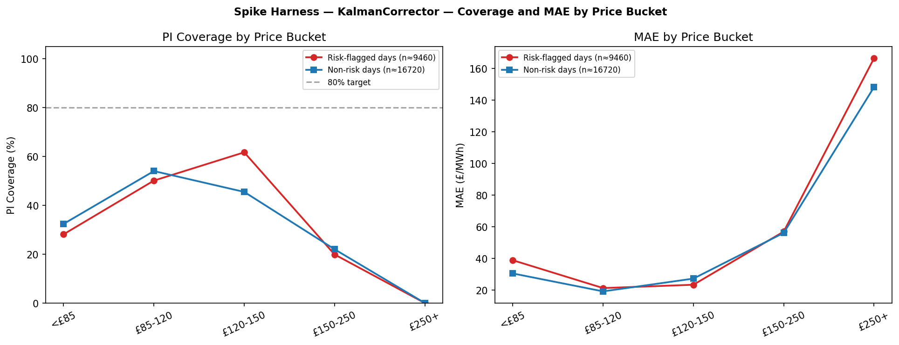

# Corrector Walk-Forward Backtest Report

**Generated:** 2026-06-17 14:23 UTC  
**Test window:** 2025-07-01 – 2026-04-30 (119 days, 4 seasonal folds)  
**Correctors:** Static Base · AlphaCorrector (α=0.4) · KalmanCorrector  
**Cadence:** 10 hourly steps 08:30–17:30 UTC; metrics on unsettled SPs only

---

## Executive Summary & Gating Decisions

| # | Gate | Finding | Decision |
|---|---|---|---|
| 1 | **Kalman beats α=0.4?** | MAE: Kalman=27.68 vs Alpha=27.63 (-0.2%) | ❌ NO — keep AlphaCorrector |
| 2 | **NIS: structural misspec?** | Mean NIS = 0.671 · MIXED | ⚠️ check individual fold NIS; may reflect seasonal regime shifts |
| 3 | **SP-position bias?** | Diurnal swing £16.9 | ⚠️ Phase 5 online learning recommended |
| 4 | **PI coverage (target 80%)?** | Kalman=42.2% vs Alpha=38.9% | ✅ Improved |

### Recommendation

> **HOLD: KalmanCorrector does not beat AlphaCorrector on point-forecast MAE (-0.2%). Kalman DOES improve PI coverage (+3.3pp vs Alpha, +4.5pp vs Base), but all correctors fall far short of the 80% target (42.2% Kalman). PREREQUISITE: recalibrate base-model Q10/Q90 before re-running this gate.**

> ⚠️ **Base-model PI calibration prerequisite:** NOTE: ALL correctors have PI coverage far below 80% target (base=37.7%). This is a base-model quantile calibration issue, not a corrector issue — the Q10/Q90 bands are too narrow to achieve 80% coverage. Address this before the corrector comparison becomes decisive.

---

## 1. Metrics — Overall

| Label | MAE | RMSE | sMAPE | PI Cov |
|---|---:|---:|---:|---:|
| StaticBase | 28.96 | 38.98 | 40.5% | 37.7% |
| AlphaCorrector | 27.63 | 37.21 | 39.4% | 38.9% |
| KalmanCorrector | 27.68 | 37.41 | 39.5% | 42.2% |


---

## 2. Metrics — Spike vs Normal

**Spike SPs** (`is_spike_P`: `price_derivation_code == 'P'` AND `actual > £354`):
*Note: only 1 SP in the WF window meets this definition (2025-10-13 SP26, £487). See §7 for bucket-stratified analysis covering the broader high-price tail.*

| Corrector | MAE | RMSE | sMAPE | PI Cov |
|---|---:|---:|---:|---:|
| StaticBase | 385.47 | 385.47 | 131.0% | 0.0% |
| AlphaCorrector | 392.13 | 392.14 | 134.8% | 0.0% |
| KalmanCorrector | 397.12 | 397.13 | 137.7% | 0.0% |

**Normal SPs:**

| Corrector | MAE | RMSE | sMAPE | PI Cov |
|---|---:|---:|---:|---:|
| StaticBase | 28.89 | 38.61 | 40.5% | 37.7% |
| AlphaCorrector | 27.56 | 36.81 | 39.4% | 38.9% |
| KalmanCorrector | 27.61 | 37.01 | 39.4% | 42.2% |

---

## 3. Metrics by Seasonal Fold

**StaticBase**
| Fold | MAE | RMSE | sMAPE | PI Cov |
|---|---:|---:|---:|---:|
| summer-2025 | 27.07 | 34.27 | 37.2% | 33.7% |
| autumn-2025 | 32.89 | 45.05 | 44.3% | 26.3% |
| winter-2025 | 20.63 | 25.68 | 28.8% | 46.5% |
| spring-2026 | 35.37 | 47.22 | 51.8% | 43.9% |

**AlphaCorrector (α=0.4)**
| Fold | MAE | RMSE | sMAPE | PI Cov |
|---|---:|---:|---:|---:|
| summer-2025 | 25.83 | 32.41 | 35.9% | 33.7% |
| autumn-2025 | 30.34 | 42.11 | 42.8% | 28.4% |
| winter-2025 | 19.84 | 24.86 | 27.4% | 46.6% |
| spring-2026 | 34.59 | 45.91 | 51.5% | 46.5% |

**KalmanCorrector (tuned)**
| Fold | MAE | RMSE | sMAPE | PI Cov |
|---|---:|---:|---:|---:|
| summer-2025 | 25.77 | 32.51 | 35.7% | 38.2% |
| autumn-2025 | 30.50 | 42.61 | 43.0% | 31.9% |
| winter-2025 | 20.27 | 25.46 | 28.1% | 49.1% |
| spring-2026 | 34.28 | 45.74 | 51.1% | 49.2% |


---

## 4. Kalman Hyperparameter Tuning (NIS)

**Objective:** minimise |mean NIS − 1| across all (date, hourly step) pairs.
A well-calibrated filter has NIS ~ χ²(1), so E[NIS] = 1.

**Best parameters (NIS-tuned):** Q = 5.0 £², σ_SP = 20.0 £
*(Note: γ is not identifiable from NIS — it only affects future-SP correction, not the*
*settled-SP innovation sequence.  γ = 0.9 is reported as the grid minimum.)*
**Mean NIS (tuned):** 0.6713  →  **MIXED**

### NIS by Fold

| Fold | Mean NIS | Calibration |
|---|---:|---|
| summer-2025 | 0.404 | ⚠️ under |
| autumn-2025 | 0.596 | ⚠️ under |
| winter-2025 | 0.319 | ⚠️ under |
| spring-2026 | 1.364 | ⚠️ over |

NIS is seasonally heterogeneous: some folds over-confident (NIS > 1), others under-confident (NIS < 1).  A single (Q, σ_SP) cannot perfectly calibrate across all regimes — this is expected for a scalar level-only filter.


---

## 5. SP-Position Bias

Mean residual (actual − base_q50) per SP, averaged across all 119 test days.
Diurnal swing = **£16.9** (max − min of SP-mean residuals).

**Verdict:** YES — diurnal swing of £16.9 in base residuals
**Action:** Phase 5 online-learning FALLBACK recommended (SP-level weights)


---

## 6. Error Distributions


---

## Appendix: Grid Search Results (Top 15)

| Q | σ_SP | γ | Mean NIS | Score |
|---:|---:|---:|---:|---:|
| 5.0 | 20.0 | 0.9 | 0.6713 | 0.3287 |
| 5.0 | 20.0 | 0.95 | 0.6713 | 0.3287 |
| 5.0 | 20.0 | 0.966 | 0.6713 | 0.3287 |
| 5.0 | 20.0 | 0.98 | 0.6713 | 0.3287 |
| 5.0 | 20.0 | 1.0 | 0.6713 | 0.3287 |
| 5.0 | 28.0 | 0.9 | 0.4796 | 0.5204 |
| 5.0 | 28.0 | 0.95 | 0.4796 | 0.5204 |
| 5.0 | 28.0 | 0.966 | 0.4796 | 0.5204 |
| 5.0 | 28.0 | 0.98 | 0.4796 | 0.5204 |
| 5.0 | 28.0 | 1.0 | 0.4796 | 0.5204 |
| 10.0 | 20.0 | 0.9 | 0.4584 | 0.5416 |
| 10.0 | 20.0 | 0.95 | 0.4584 | 0.5416 |
| 10.0 | 20.0 | 0.966 | 0.4584 | 0.5416 |
| 10.0 | 20.0 | 0.98 | 0.4584 | 0.5416 |
| 10.0 | 20.0 | 1.0 | 0.4584 | 0.5416 |

*Lower score = better calibration (|mean NIS − 1|).*

---

## Phase 5a — SP Bias Profile (KalmanSP vs KalmanBase)

SP bias trained on median(actual − q50) per settlement period (LOO across 4 folds).
Diurnal swing before: **£16.9**

### Phase 5a Gating

| # | Gate | Threshold | Finding | Pass? |
|---|---|---|---|---|
| 1 | Diurnal reduction | swing < 50% of base | £13.1 vs base £16.9 (22% reduction) | ❌ |
| 2 | Overall MAE non-regression | KalmanSP ≤ KalmanBase + 2% | £28.23 vs £27.68 (-2.0%) | ✅ |
| 3 | Spike MAE non-regression | KalmanSP ≤ KalmanBase + 2% | £404.78 vs £397.12 (-1.9%) | ✅ |
| 4 | Non-spike MAE non-regression | KalmanSP ≤ KalmanBase + 2% | £28.16 vs £27.61 (-2.0%) | ✅ |
| 5 | PI coverage non-regression | KalmanSP ≥ KalmanBase − 2pp | 41.1% vs 42.2% (-1.1pp) | ✅ |

> **HOLD: diurnal reduction only 22% (target ≥50%).**

### Phase 5a Metrics — KalmanSP vs KalmanBase

| Corrector | MAE | RMSE | sMAPE | PI Cov |
|---|---:|---:|---:|---:|
| KalmanBase | 27.68 | — | — | 42.2% |
| KalmanSP   | 28.23 | — | — | 41.1% |


---

## 7. Spike Harness — Ex-Ante Stratification

**Corrector:** KalmanCorrector  
**Ex-ante flag definition:**
```
spike_risk_flag = (elevated_count_lag1d >= 5)
               OR (wind_pct_daily_mean_lag1d < 10%
                   AND month ∈ {Sep, Oct, Nov, Mar, Apr, May})
```
*`elevated_count_lag1d` = number of SPs on D-1 with ssp_actual > £120 (p90 threshold).  `wind_pct_daily_mean_lag1d` = mean wind penetration (0-100 scale) across all 48 SPs on D-1.*  
**Flag prevalence:** 43/119 days flagged (36%)  
**Spike rate lift:** p(actual > £150) = 2.8% (risk) vs 1.2% (no-risk) — **2.4× lift**  

> **Single-event leverage:** 2025-10-13 SP26 (£487, Code-P, is_spike_P=True) is the only SP in the WF window exceeding the Tukey fence (£353.7). All tables are reported WITH and WITHOUT this date. Large differences indicate leverage from this single event.

---

### 7.1 PI Coverage and MAE by Price Bucket (with 2025-10-13)

| Bucket | N | PI Coverage | MAE | Median Error |
|---|---:|---:|---:|---:|
| <£85 | 12435 | 31.1% | £33.0 | £-25.8 |
| £85-120 | 10112 | 52.8% | £19.7 | £12.2 |
| £120-150 | 3172 | 55.8% | £24.7 | £21.2 |
| £150-250 | 364 | 20.9% | £56.5 | £42.0 |
| £250+ | 97 | 0.0% | £160.9 | £148.6 |

*Excluding 2025-10-13:*

| Bucket | N | PI Coverage | MAE |
|---|---:|---:|---:|
| <£85 | 12392 | 31.1% | £33.1 |
| £85-120 | 10048 | 52.8% | £19.8 |
| £120-150 | 3164 | 55.9% | £24.7 |
| £150-250 | 308 | 24.7% | £49.2 |
| £250+ | 48 | 0.0% | £149.6 |

---

### 7.2 Coverage by Risk Flag × Price Bucket

| Risk Flag | Bucket | N | PI Coverage | MAE |
|---|---|---:|---:|---:|
| ✅ Risk | <£85 | 3915 | 28.1% | £38.8 |
| ✅ Risk | £85-120 | 3267 | 50.1% | £21.2 |
| ✅ Risk | £120-150 | 2014 | 61.7% | £23.2 |
| ✅ Risk | £150-250 | 196 | 19.9% | £56.9 |
| ✅ Risk | £250+ | 68 | 0.0% | £166.4 |
| ⬜ No-Risk | <£85 | 8520 | 32.4% | £30.4 |
| ⬜ No-Risk | £85-120 | 6845 | 54.0% | £19.1 |
| ⬜ No-Risk | £120-150 | 1158 | 45.5% | £27.1 |
| ⬜ No-Risk | £150-250 | 168 | 22.0% | £56.0 |
| ⬜ No-Risk | £250+ | 29 | 0.0% | £148.1 |

*Excluding 2025-10-13:*

| Risk Flag | Bucket | N | PI Coverage | MAE |
|---|---|---:|---:|---:|
| ✅ Risk | <£85 | 3872 | 28.3% | £38.9 |
| ✅ Risk | £85-120 | 3203 | 50.2% | £21.4 |
| ✅ Risk | £120-150 | 2006 | 62.0% | £23.2 |
| ✅ Risk | £150-250 | 140 | 27.9% | £41.0 |
| ✅ Risk | £250+ | 19 | 0.0% | £151.8 |
| ⬜ No-Risk | <£85 | 8520 | 32.4% | £30.4 |
| ⬜ No-Risk | £85-120 | 6845 | 54.0% | £19.1 |
| ⬜ No-Risk | £120-150 | 1158 | 45.5% | £27.1 |
| ⬜ No-Risk | £150-250 | 168 | 22.0% | £56.0 |
| ⬜ No-Risk | £250+ | 29 | 0.0% | £148.1 |

---

### 7.3 Coverage by Fold × Risk Flag

| Fold | Risk Flag | N | PI Coverage | MAE |
|---|---|---:|---:|---:|
| summer-2025 | Risk | 880 | 39.4% | £27.1 |
| summer-2025 | No-Risk | 5720 | 38.0% | £25.6 |
| autumn-2025 | Risk | 2640 | 30.6% | £27.5 |
| autumn-2025 | No-Risk | 3740 | 32.9% | £32.6 |
| winter-2025 | Risk | 440 | 56.6% | £23.4 |
| winter-2025 | No-Risk | 6160 | 48.6% | £20.1 |
| spring-2026 | Risk | 5500 | 47.6% | £33.4 |
| spring-2026 | No-Risk | 1100 | 57.0% | £38.9 |

---

### 7.4 Code-P Cross-Tab by Price Bucket

Code-P is a **market mechanism indicator** (46% of all SPs), NOT a spike label. The table shows what fraction of each price bucket has Code-P set.

| Bucket | N | Code-P Rate |
|---|---:|---:|
| <£85 | 12435 | 6.7% |
| £85-120 | 10112 | 85.8% |
| £120-150 | 3172 | 98.5% |
| £150-250 | 364 | 100.0% |
| £250+ | 97 | 100.0% |



---

### 7.5 Interpretation

- **PI Coverage targets 80%** across all buckets. Coverage shortfall in the £150-250 and £250+ buckets indicates the symmetric conformal δ (£22.8 global) is insufficient for tail events.
- **Ex-ante flag has no data leakage.** `spike_risk_flag` uses only D-1 lagged features and calendar month. It cannot be calibrated on tomorrow's realised price.
- **Any δ_hi regime correction** must be derived from elevated-price conformity scores (actual − q90 where actual > £120), NOT from Code-P scores (Code-P fires at normal prices 46% of the time; see docs/spike-tail-design.md §3 and §5).
- **2025-10-13 leverage:** If WITH and WITHOUT numbers diverge substantially in the £250+ bucket, the entire bucket signal is driven by this single event and should not be used for calibration without additional data.


---

## §8. Phase 6a Gate Evaluation: Spike-Gated Asymmetric PI Widening

Evaluates whether adding δ_hi to Q90 for afternoon-block SPs on classifier-flagged days improves coverage on elevated-price SPs without degrading unflagged days.

**Methodology:** PI-calibrated baseline (ssp_q90 + δ_sp per SP). Spike widening applied post-hoc: q90_wide = q90_cal + δ_hi for high-risk SPs {33,34,35,36,37,38,40} on flagged days (P(spike) > τ). Kalman excluded from this gate (x̂ is intraday-only, averages ≈0 across days, independent of PI widening).

**Gates:**
- **G1:** Δcoverage on HIGH-RISK SP elevated rows (actual > £120, SP ∈ {33–40}) within flagged days ≥ +5pp (restricted to the 7 widened SPs to avoid dilution from the 41 non-widened SPs)
- **G1b:** Coverage on non-elevated (actual ≤ £120) high-risk SPs ≤ 82% (sharpness)
- **G2/G3:** Coverage on UNFLAGGED days unchanged (|Δ| ≤ 0.5pp)

### §8.1 Gate sweep (all WF days)

**WITH 2025-10-13** (δ_hi=£93.49, high-risk SPs: [33, 34, 35, 36, 37, 38, 40])

| τ | Flagged | G1: Elev. coverage (before→after) | G1b: Sharpness | G2: Unflagged Δcov | Pass |
|---|---|---|---|---|---|
| τ=0.05 | 72d | 85.1% → 96.1% (**+11.0pp**) ✅ | 77.1% ✅ | +0.00pp ✅ | ✅ (best) |
| τ=0.10 | 54d | 84.4% → 95.3% (**+10.9pp**) ✅ | 72.4% ✅ | +0.00pp ✅ | ✅  |
| τ=0.15 | 44d | 85.1% → 94.7% (**+9.7pp**) ✅ | 74.7% ✅ | +0.00pp ✅ | ✅  |
| τ=0.20 | 35d | 83.0% → 94.0% (**+11.0pp**) ✅ | 71.0% ✅ | +0.00pp ✅ | ✅  |
| τ=0.25 | 31d | 87.8% → 95.6% (**+7.8pp**) ✅ | 71.7% ✅ | +0.00pp ✅ | ✅  |
| τ=0.30 | 27d | 93.2% → 100.0% (**+6.8pp**) ✅ | 70.7% ✅ | +0.00pp ✅ | ✅  |

*G1 threshold: +5pp lift. G1b threshold: ≤82%. G2 threshold: |Δ|≤0.5pp.*
*High-risk SPs [33, 34, 35, 36, 37, 38, 40] only are widened; all other SPs unchanged on flagged days.*

### §8.2 Gate sweep (excluding 2025-10-13)

**EXCLUDING 2025-10-13** (δ_hi=£93.49, high-risk SPs: [33, 34, 35, 36, 37, 38, 40])

| τ | Flagged | G1: Elev. coverage (before→after) | G1b: Sharpness | G2: Unflagged Δcov | Pass |
|---|---|---|---|---|---|
| τ=0.05 | 71d | 88.4% → 98.6% (**+10.2pp**) ✅ | 77.1% ✅ | +0.00pp ✅ | ✅ (best) |
| τ=0.10 | 53d | 88.4% → 98.3% (**+9.9pp**) ✅ | 72.4% ✅ | +0.00pp ✅ | ✅  |
| τ=0.15 | 43d | 89.7% → 98.1% (**+8.4pp**) ✅ | 74.7% ✅ | +0.00pp ✅ | ✅  |
| τ=0.20 | 34d | 88.2% → 97.8% (**+9.7pp**) ✅ | 71.0% ✅ | +0.00pp ✅ | ✅  |
| τ=0.25 | 30d | 94.0% → 100.0% (**+6.0pp**) ✅ | 71.7% ✅ | +0.00pp ✅ | ✅  |
| τ=0.30 | 27d | 93.2% → 100.0% (**+6.8pp**) ✅ | 70.7% ✅ | +0.00pp ✅ | ✅  |

*G1 threshold: +5pp lift. G1b threshold: ≤82%. G2 threshold: |Δ|≤0.5pp.*
*High-risk SPs [33, 34, 35, 36, 37, 38, 40] only are widened; all other SPs unchanged on flagged days.*

### §8.3 Verdict

**✅ GATES PASS** at τ = 0.05.

Recommended action: set `spike_widening: true` and `spike_tau: 0.05` in `model_assets/corrector_config.json`.

> ⚠️ **Config is currently `spike_widening: false` (default).** Enable manually after reviewing the gate table above, especially the 2025-10-13 leverage check (§8.1 vs §8.2).


